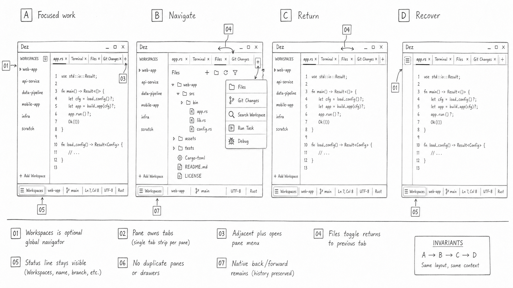

# Annotated Workspace Workflow Wireframe

> Status: implementation contract for the native surfaces identified below.
> Layout and bounded Activity are implemented. Temporary navigation mode and
> return recap remain unimplemented until their rows explicitly say otherwise.
> The monochrome raster is a review aid; this document owns copy and
> interaction semantics.

The product loop is:

> **Open Workspace → start or resume work → supervise Activity → inspect and
> review in the Main Work Area.**



The raster was reviewed for one-sidebar ownership, activation-only Layout rows,
native adjacent `+` controls, healthy-state access visibility, inline return
recap, and terminal-owned recovery. The numbered ledger below remains
authoritative where generated lettering is abbreviated.

## A. Begin without an overlay

```text
┌ Workspaces [01] ───────┬ Home | + [05] ───────────────────────────────┐
│ No Workspace open      │ Continue your work                           │
│                        │ Open a codebase, start work, then review it.  │
│ [Open Workspace…] [09] │                                              │
│ Clone Repository…      │ Recent Workspaces                            │
│                        │  paykit · ~/dev/paykit                        │
│                        │  dez · ~/dev/dez                              │
│                        │                                              │
│                        │ After a Workspace opens                       │
│                        │  Open Terminal · Default [10]                 │
│                        │  Codex · Claude Code · OpenCode               │
│                        │  Workspace tmux · Open in cmux [15]           │
├────────────────────────┴──────────────────────────────────────────────┤
│ No Workspace | Open Workspace…                         Dez Preview    │
└───────────────────────────────────────────────────────────────────────┘
```

Home exposes one primary decision. Tool launch remains subordinate until a
Workspace supplies a root, Git context, search scope, and review destination.

## B. Focused work

```text
┌ Workspaces [01] ─────────┬ main.rs | Files | + [05] ┬ Claude Code | + ┐
│ paykit · main [02]       │ editor                   │ provider TUI [07]│
│                          │                          │                  │
│ Layout · 4 tabs [03]     │                          │                  │
│  Pane 1 · Focused [06]   │                          │                  │
│   main.rs                │                          │                  │
│   Files                  │                          │                  │
│  Pane 2                  │                          │                  │
│   Claude Code            │                          │                  │
│   Terminal               │                          │                  │
│                          │                          │                  │
│ Activity · 2 [04]        │                          │                  │
│  Claude Code · Waiting   │                          │                  │
│  test · Running · 42s    │                          │                  │
├──────────────────────────┴──────────────────────────┴──────────────────┤
│ paykit / main [08]  Pane 1 of 2 · 1 waiting   PR #5 · Draft   Ln 14  │
└────────────────────────────────────────────────────────────────────────┘
```

Layout activates native tabs but never closes or reorganizes them. Activity is
bounded and contains only authoritative running or actionable signals.

## C. Navigate without covering work

```text
┌ Workspaces ───────────────┬ [1] main.rs | Files | + ┬ [2] Claude Code | + ┐
│ paykit                    │ existing content         │ existing TUI          │
│ Layout                    │ remains visible          │ remains visible       │
│  Pane 1 · Focused         │                          │                       │
│  Pane 2                   │                          │                       │
├───────────────────────────┴──────────────────────────┴───────────────────────┤
│ NAVIGATE [11]  [1] Pane 1  [2] Pane 2  [W] Workspace  [?] Keys  [Esc] Exit │
└──────────────────────────────────────────────────────────────────────────────┘
```

Navigation reuses the status line and native pane chrome. It does not open a
palette, dim content, or draw a blocking target overlay.

## D. Return to supervised work

```text
┌ Workspaces ───────────────┬ main.rs | Files | + ─────────────────────┐
│ paykit                    │ Since you left [12]                       │
│ Layout                    │ 3 files changed · test passed             │
│  Pane 1 · Focused         │ Review ready            [Review] [Dismiss]│
│  Pane 2 · Claude Code     ├───────────────────────────────────────────┤
│                           │ editor                                    │
│ Activity · 3              │                                           │
│  Claude Code · Waiting    │                                           │
│  Codex · Working · 6m     │                                           │
│  test · Passed · Review   │                                           │
├───────────────────────────┴───────────────────────────────────────────┤
│ paykit / main  Pane 1 of 2 · 2 active · 1 waiting      PR #5 · Draft │
└───────────────────────────────────────────────────────────────────────┘
```

The recap appears once and uses repository, task-exit, authenticated agent, and
pending-review events only. It never summarizes arbitrary PTY transcript text.

## E. Recover with content preserved

```text
┌ Workspaces ───────────────┬ Terminal · Herdr attach · Failed | + ────┐
│ paykit                    │ $ herdr attach workspace                  │
│ Activity                  ├───────────────────────────────────────────┤
│  Herdr · Retry available  │ Attach failed · connection unavailable    │
│                           │ External process ownership is unchanged.  │
│ Access required [14]      │ [Retry Attach] [Open new shell here] [13] │
│ ~/Documents/paykit        ├───────────────────────────────────────────┤
│ [Grant Access…]           │ preserved terminal output                 │
│                           │ ~/paykit %                                 │
├───────────────────────────┴───────────────────────────────────────────┤
│ paykit / main | Permissions: Access required | Host: Ready            │
└───────────────────────────────────────────────────────────────────────┘
```

Permission recovery belongs to Workspaces and is aggregated once per exact
root. Attach recovery belongs to Terminal and preserves output. Neither flow
uses a custom overlay or claims external process migration.

## F. Open Files and return without losing tabs

```text
┌ Workspaces ───────────┬ app.rs | Terminal | Files | Git Changes | + ─┐
│ paykit · main         │                                                 │
│ Layout                │ app.rs                                          │
│  Pane 1 · Focused     │                                                 │
│   app.rs              │ Open Files activates the existing Files tab.   │
│   Terminal            │ Activating Files again returns to app.rs       │
│   Files               │ through native recent-tab history.             │
│   Git Changes         │                                                 │
├───────────────────────┴─────────────────────────────────────────────────┤
│ Workspaces · paykit | main | Ln 14, Col 22                              │
└──────────────────────────────────────────────────────────────────────────┘
```

Files is an ordinary pane tab, not a permanent drawer. Opening a different
file creates a durable tab by default; preview tabs remain an explicit user
preference. The top Files control reflects whether Files is active and uses
**Return from Files** for its second action. The native `+` menu groups
**Workspace tmux**, **Browse Running Sessions…**, and **Open Workspace in
cmux** under **Sessions and Multiplexers**, then exposes icon-backed **Files**,
**Git Changes**, **Search Workspace…**, **Run Task…**, and **Debug** rows.

The labeled **Workspaces · name** status control remains present whether the
navigator is open or closed. It changes between **Open Workspaces** and **Hide
Workspaces** without removing the durable status line.

## Annotation ledger

| # | Owner | Action | Invariant | Failure rule |
| --- | --- | --- | --- | --- |
| 01 | MultiWorkspace and Workspaces | switch codebases | one global navigator | stays reachable from status when closed |
| 02 | Workspace | activate durable codebase context | Workspace is not a terminal list | access/install state replaces background failure loops |
| 03 | native pane entities | activate existing pane/tab | no close, pin, reorder, drag, preview, or split ownership | hidden for one tab and while search owns the list |
| 04 | trusted agent/task/terminal stores | focus an actionable owner | no transcript preview or guessed success | absent when empty; stale external state is named |
| 05 | native pane tab strip | create content through native Add | adjacent `+` remains visible per pane; files stay open by default | disabled action explains missing capability |
| 06 | native pane group | focus a pane | focus is text plus treatment, never color alone | narrow mode preserves pane identity before tab rows |
| 07 | TerminalView and terminal host | interact with the provider TUI | Dez does not wrap TUIs in custom chat chrome | output remains visible under lifecycle recovery |
| 08 | native status bar | expose durable target and repository context | one status line; Workspaces remains labeled while open or closed | explicit preference may hide it; recovery route remains labeled |
| 09 | Home/Workspace open action | open one codebase | one primary empty-state action | install-first or root grant stays native and inline |
| 10 | active Workspace | start named Terminal/agent work | launch names its destination | missing command routes to Terminal Launch settings |
| 11 | Workspace navigation action namespace | enter one-shot target mode | no content-covering overlay | one action or Escape exits and restores normal status |
| 12 | owning pane | review a trusted return recap | one-time and event-backed | no recap when evidence is incomplete |
| 13 | failed Terminal tab | retry attach or start separate work | new shell never claims migration | repeated failure remains inline with diagnostics |
| 14 | Workspace access preflight | grant one exact folder | one prompt and one aggregated root state | Git/Search/LSP/agent startup waits without flooding logs |
| 15 | cmux external owner | hand the Workspace to cmux | cmux owns its tabs, splits, browser, hooks, and actions | handoff failure leaves the Workspace open in Dez |

## Implementation order

1. **Implemented:** active Workspace contains activation-only Layout.
2. **Implemented:** Activity contains only active, running, actionable,
   recoverable, or review-ready work from trusted lifecycle state. Completed
   history remains in Agent History.
3. **Then:** add one-shot navigation mode after a Zed keymap collision audit.
4. **Then:** add return recap after the trusted event schema exists.
5. **Always:** preserve native ownership, permission aggregation, terminal
   output, adjacent `+`, and the status line.
