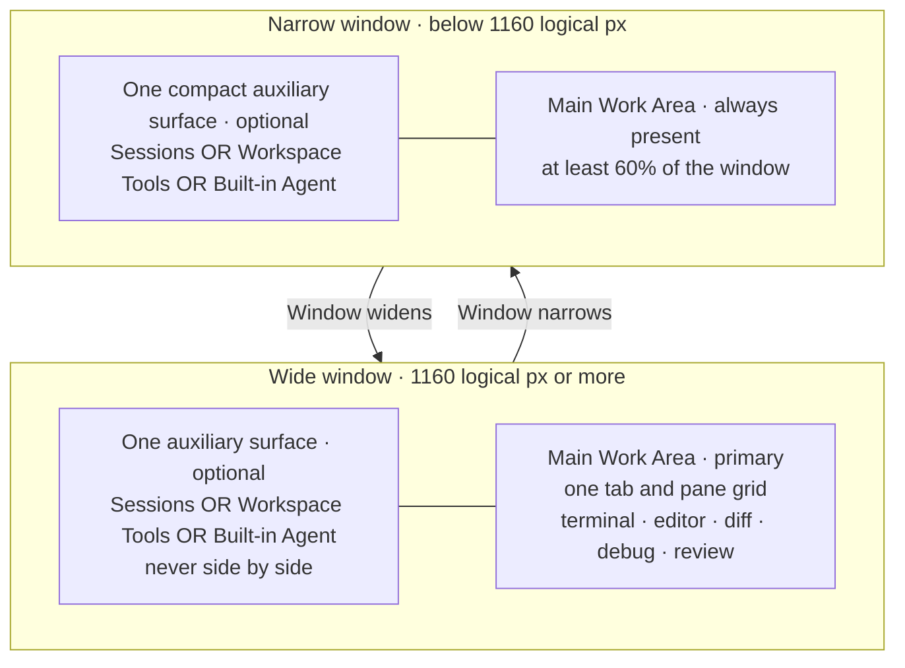
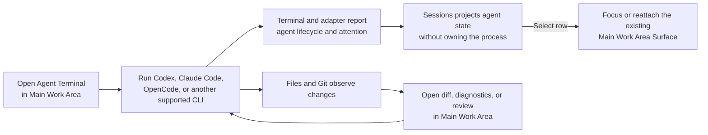
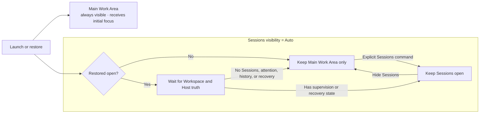

# Dez Fork Notes

This is the permanent product and architecture source of truth for Dez. Plans,
release checklists, and historical design documents must conform to it.

## Product definition {#product-definition}

Dez is a complete native development environment and durable computing
workspace for terminal-native developers who work directly and supervise
coding agents or long-running sessions across repositories and hosts.

Zed supplies the native editor, GPUI, language support, Git, debugger, remote
infrastructure, collaboration substrate, and agent ecosystem. Dez continuously
inherits those capabilities while changing the product model around them.

The GUI is a client over durable work. The editor is a surface in the
workspace, not the owner of the application. Dez is not "Zed with more
terminals" and not a panel that lists more agents.

The initial promise is:

> You can see what is running, what needs attention, what changed, and what is
> ready for review without reconstructing terminal and editor state.

Direct editing, debugging, testing, Git, search, and navigation remain
first-class product work. Multi-agent supervision is the first customer and
delivery wedge, not a reason to reduce editor quality or fork compatible Zed
capabilities.

## Product primitives {#product-primitives}

- **App Session:** The durable application universe. It owns Workspace
  identity, order, active and unresolved records, shared registries, and
  viewport state without owning window-bound GPUI entities.
- **Workspace:** Durable human context containing panes, surfaces, focus,
  history, and local navigation state. It does not own a permanent project
  root.
- **Surface:** A draggable pane item such as a file, terminal, agent, Git view,
  search, debugger, browser, settings page, or review.
- **Evidence:** Typed, provenance-bearing context or verification contributed
  by path-bearing surfaces, Hosts, processes, structured events, Git, and the
  filesystem. Evidence is labeled observed, derived, agent-reported,
  user-confirmed, or unknown.
- **Host:** A local or remote machine or execution environment that owns
  processes.
- **Environment:** A reproducible description or activation mechanism for
  dependencies and services. It may configure a Host context but is neither a
  Host nor a Workspace.
- **Session:** Durable computation owned by a host rather than by the GUI.
- **Actor:** A human, agent, task, debugger, or process performing work.
- **Run:** The user-facing unit that connects an objective, actor, host,
  session, evidence, repository state, observed commands and checks, attention,
  review, and outcome. A shell can remain a session without becoming a Run.
- **Change Set:** A logical reviewable relationship between intent, one or more
  Runs, repository identity, files or hunks, Evidence, and review status. Git
  remains authoritative for v0.0.1; a Change Set is not a second Git database.
- **Projection:** Navigation or status UI derived from real surfaces and
  sessions. A projection never owns duplicate lifecycle state.

## Interface composition {#interface-composition}

Dez uses one pane grid and one supervision projection. User-facing names
describe purpose, not the inherited dock or panel implementation:

| Region              | Owns                                                               | Does not own                                                        |
| ------------------- | ------------------------------------------------------------------ | ------------------------------------------------------------------- |
| **Agent Sessions**  | Search, attention scope, Workspace grouping, and navigation        | Terminal processes, Agent Sessions, editor state, or duplicate tabs |
| **Workspace Tools** | Files, Outline, Git, and Debug tabs in a hideable left tool pane   | A second Workspace, root selection, or terminal placement           |
| **Main work area**  | File, terminal, search, diagnostics, settings, and review Surfaces | Global project scope or sidebar-only copies of active work          |
| **Built-in Agent**  | Native and ACP conversation Surfaces in a hideable right tool pane | Terminal-agent process ownership                                    |

The final shell follows this responsive layout contract. This is the canonical
wireframe, not a suggestion for an additional dashboard or panel system:



The visible work loop uses those same regions; it does not create a second
agent dashboard:



Running a terminal-native agent such as Codex does not turn the Sessions region
into a chat transcript. Its terminal remains the interactive source of truth in
the Main Work Area; Sessions becomes the compact place to see that it is live,
needs attention, or has reviewable evidence. Native and ACP conversations use
the Agent drawer and project into the same Sessions list. Both paths return to
the existing Surface rather than opening a duplicate.

The visible title is **Agent Sessions**, not a generic terminal sidebar.
Ordinary integrated shells stay in the Main Work Area. Read-only machine
observations are separated under **On This Mac**, where the UI states that Dez
does not own those PTYs.

Sessions restoration follows this lifecycle:



The Main Work Area is never replaced by shell navigation. Sessions, Workspace
Tools, and Built-in Agent share one optional auxiliary slot at every width.
Opening one hides whichever of the other two is visible. The transition is
normal layout and focus movement, never a floating overlay. Wide windows give
their extra space to the Main Work Area instead of accumulating persistent
columns.
Transient progress and notices remain bounded and nonmodal; dialogs are
reserved for decisions that block progress.

**Auto** is a restore policy, not permission to surprise the user during
ordinary work. A restored-open Sessions region waits until Workspace and
Terminal Host restoration can report honest state. It then closes itself only
when it is genuinely empty. A Session, attention item, Agent History view,
failed Workspace recovery, or failed/reconnecting Terminal Host keeps it open.
Any explicit Sessions command or focus cancels the pending automatic close.

Dez renders no persistent Sessions footer. Secondary destinations live behind
one named **Sessions Menu** in the overview: **Agent History**, **Open Recent
Workspaces…**, and Agent tooling/settings. **Hide Sessions** remains the one
direct adjacent action because it changes the current layout. Recovery notices
open the global Recent Workspaces surface rather than relying on a hidden
popover anchor. Official Zed retains its inherited footer.

Sessions and the Main Work Area form one continuous window shell. Dez does not
put a desktop-colored gutter or four-sided floating-card frame between them.
One neutral one-pixel divider marks the shared structural edge; only the
window-facing outer corners inherit the native window radius. Lumin
translucency therefore reads as one bounded application surface rather than
separate glass cards floating over the desktop.

Every visible **Open Agent Terminal** action creates a normal main-area terminal
Surface. It can be tabbed, split, moved, detached from a durable Host Session,
or reattached without introducing a separate Terminal Panel model. Opening the
terminal alone does not create a Sessions row; the user still starts a
supported agent CLI inside it.

Sessions rows are projections. Selecting a terminal row focuses its
attached terminal Surface or reattaches the Host-owned Session. Selecting an
Agent Session row focuses its existing conversation Surface. A row may compose
actor, lifecycle, attention, evidence, changes, and recency, but it never
becomes a second owner of those facts.

### Session admission contract

Sessions is an agent supervisor, not a list of every shell.

- An ordinary Dez terminal remains only in the Main Work Area.
- A terminal enters Sessions when a supported foreground agent is detected, a
  structured agent snapshot exists, or Dez explicitly owns it as a managed
  Agent terminal.
- Launching an agent promotes the existing terminal identity; it does not open a
  second Surface or create a transcript.
- Returning from a detected agent to an ordinary shell removes the projection
  while leaving the terminal tab and process intact.
- Generic shell titles, working directories, and terminal output are not agent
  evidence and must not create Session Details.
- Dez does not capture PTYs owned by Terminal.app, iTerm2, Warp, VS Code, or
  another application. External adoption requires an explicit protocol such as
  a future `tmux` adapter and is outside the v0.0.2 contract.

This admission rule is enforced at every source of terminal metadata: live
Workspace terminals, saved metadata, and detached Host sessions. Hidden
ordinary terminals remain subscribed to process-info changes so a newly started
agent can be promoted without reopening the terminal or the Sessions region.

Terminal title data remains full through local, durable Host, retained-Agent,
Sessions, and Session Switcher metadata paths. Visual tabs and rows own
space-based truncation so tooltips and restored projections retain useful
identity. Explicit custom names are trimmed, persist across restoration, and
override the live shell title without discarding decorative agent-state
prefixes. The action is named **Rename Terminal…** and double-clicking the tab
invokes the same editor.

At zero sessions, the overview owns the rail title and **No agent sessions**
status. With no Workspace open, the compact state says **No Workspace open**,
explains that project context comes first, and offers one filled **Open
Workspace…** action. It does not create a pathless terminal branch or repeat
the launch/supervise/review route owned by Welcome. With an active Workspace
but no Session, that Workspace group owns the primary **Open Agent Terminal**
action.
Start, search recovery, attention scope, and Session scope actions are keyboard
tab stops and name their destination in accessibility output.
Once one or more Sessions exist, the overview remains status and scope only.
Each Workspace header owns its exact terminal-creation destination, preventing
the active Workspace from exposing the same launcher twice. Official Zed may
retain its compatibility overview control.

Workspace Tools and Built-in Agent are ordinary pane-grid regions with stable
placement and normal focus behavior. Hiding one keeps its items available,
returns focus to a visible editor or terminal pane, and persists the layout.
Opening a named tool reveals the correct region and activates its existing
tab.

### Everyday routing {#interface-everyday-routing}

Action names describe their destination. They do not expose inherited panel
terminology:

| Intent                                        | Result                                                                 |
| --------------------------------------------- | ---------------------------------------------------------------------- |
| **Open Agent Terminal**                       | Opens a terminal tab in the active Workspace's main work area          |
| **New Built-in Agent Session…**               | Opens or focuses a provider-backed conversation in Built-in Agent      |
| **Files**, **Outline**, **Git**, or **Debug** | Opens the named tab in left-side Workspace Tools                       |
| Select a Sessions row                         | Activates its Workspace and focuses or reattaches the existing Surface |
| Hide Workspace Tools or Built-in Agent        | Hides that region and returns focus to an editor or terminal           |
| Split or move a Surface                       | Rearranges the same Workspace; it does not create a second project     |

The active or keyboard-focused Workspace keeps **Open Agent Terminal** and
**Workspace Options** visible. Other inactive Workspace actions may reveal on
hover because selecting or focusing the Workspace first makes the same controls
persistent. Every icon-only control must retain an accessible name, tooltip,
and keyboard tab stop. Repeated Workspace-row controls include the visible
Workspace name in both; internal element and hover-group identifiers are
presentation-only and must never enter user-facing copy.

Visible controls must also perform their advertised action: the Agent title
pencil starts editing, worktree closure names its window scope, and the
main-area overflow control is **Switch Surface**, not Open Tab.

Action hierarchy follows the next useful transition. Dez Welcome emphasizes
exactly one recommended first action: **Open Workspace** without a codebase, or
**Open Agent Terminal** in an active Workspace. Secondary creation and
navigation actions remain available without competing for the same visual
weight. Critical controls must not depend on pointer hover in Dez. Icon-only
toolbar controls must be keyboard-focusable, expose a specific accessible
name, and use the same wording in their tooltip. Official Zed compatibility
branches may retain upstream hover and icon behavior.

Welcome follows progressive disclosure. With no Workspace it offers only
**Open Workspace** and **Clone Repository**. A terminal is not offered until a
codebase can supply review context. With a Workspace it offers **Open Agent
Terminal**, **Open Files**, and **New File**. Generic utilities such as the
command palette and replacing the active Workspace remain available through
normal chrome, but do not compete with the release-defining start loop. Its
headline is a concrete product promise rather than a second copy of the
three-step guide: before a Workspace, it explains that opening one connects
terminal and Agent work with files, Git, diagnostics, and diffs; inside one, it
says that work stays connected and reviewable in the IDE. **Run · Terminal →
Supervise · Sessions → Review · Files & Git** is one compact passive route. It
has no enclosing card, section divider, paragraph stack, numbered selection
pill, or control background.

The active empty Main Work Area uses the same **Open Agent Terminal**
vocabulary. Its orientation is part of the native work surface, not a bordered
card floating over it. The focused empty work area says **Run an agent in this
Workspace**, explains detection in one sentence, and presents only the three
immediate actions. It does not repeat Welcome's workflow diagram. In an
explicit multi-pane layout, inactive empty work areas say **Open something
here** and keep the same operational actions. The action row owns all
interactive styling. Copy describes live terminal and Agent state without
calling the default GUI-owned terminal durable; durability is shown only when
an external Host actually owns the exact Session.

Empty primary regions use compact, top-anchored recovery guidance rather than
floating a small prompt in the middle of an empty pane. The heading names the
missing prerequisite, the explanation is specific to Files, Git, or Agent, and
the primary action says **Open Workspace**. That action always accepts folders
and keeps the current Dez window: a file cannot accidentally satisfy a
Workspace prerequisite, and recovery cannot strand the current Sessions in a
different window. Shared Open Workspace and Clone Repository controls are
keyboard tab stops.

Popover triggers expose their current state as well as their destination.
Agent Options and New Agent Session use selected treatment while open and
report expanded state to assistive technology; closing the popover clears both
signals.

Dez Agent onboarding is provider setup, not Zed AI subscription onboarding.
The reachable empty state is a named **Agent provider setup** region that says
**Agent Session**, offers **Configure Agent Providers**, and exposes **Start
Agent Session** only after a non-Zed-cloud provider is authenticated. Both
actions are keyboard tab stops. The setup is an in-flow part of the Agent
surface: it inherits the pane material and uses one divider, never an elevated
card, nested glass layer, or gradient mask. Inherited Zed plan/trial components
and their card presentation may remain for upstream compatibility, but the Dez
Agent entry path must not render them.

The product must not create a native Built-in Agent draft until the language
model registry has an authenticated, usable default model. Workspace Options
uses **Configure Built-in Agent…** while that prerequisite is missing and
routes directly to provider settings. Once ready, it uses **New Built-in Agent
Session…**. Direct New Agent actions follow the same gate. Restored setup
guidance remains in flow and cannot be dismissed into an unusable blank
composer; passive restoration never opens provider settings by itself.

The Agent composer control row has one interaction contract. Expand or
minimize, Add Context, Follow, Fast Mode, Thinking Mode, thinking effort,
Send/Queue, Stop Agent Run, and Sandbox Settings are keyboard tab stops with
specific accessible names. Toggle controls report their current state, popup
controls report expanded state and current value where applicable, and active
state uses selected treatment rather than icon color alone. These controls
configure or operate the current Agent Session; they do not create hidden
terminal ownership or a second Project.

Conversation follow-up controls remain visible at rest instead of lowering the
entire action row to decorative contrast. Copy Response, return-to-prompt,
return-to-top, feedback, and feedback submission are named keyboard tab stops;
feedback reports its selected state.

Queued messages form a named ordered list. Every row reports its position and
whether it is next, uses a row-specific status identifier, and keeps Remove,
Edit, Steer, and Send Now visibly available to pointer and keyboard users.
Steer changes when that queued message interrupts the current Agent Run; Send
Now operates on the exact queued-message identity.

Agent permission prompts keep Allow, Deny, retry, and provider-supplied choices
in the keyboard tab order. Permission Scope reports its current value and
expanded state, uses selected treatment while open, and applies the chosen
scope to the exact pending tool call. A warning may disable Allow, but it must
not hide Deny or Retry.

Agent Review is an IDE workflow, not hover decoration. Every changed-file row
keeps Review, Reject, and Keep visible at rest, assigns row-specific element
identity, and preserves the exact Buffer target. Pending edits disable Keep and
Reject with an explicit reason. Review Changes, Reject All, and Keep All are
keyboard tab stops.

A subagent title bar names **Stop Subagent** and **Return to Parent Agent
Session** as keyboard actions. Returning changes presentation only; it
navigates to the existing parent conversation and does not cancel or recreate
either Session.

Restoring an Agent checkpoint is a consequential Workspace-wide file
replacement. Dez names the scope, requires a warning confirmation with
**Restore Files** and **Cancel**, and only invokes the exact message checkpoint
after confirmation. Cancelling or restarting an edited message is separately
named and keyboard-reachable.

Agent errors and warnings separate state from recovery. Retry, Authenticate,
Configure Provider, Select Model, Open Skill, environment recovery, updates,
and dismiss controls are keyboard tab stops with specific names. Dismiss only
hides the named notice; it never claims to retry, repair, configure, or clear
the underlying condition. Provider retry copy names the running product, never
inherited Zed.

The shared Copy control is keyboard-addressable when rendered and exposes the
same name as its tooltip, including its temporary copied state. Skill-warning
rows name the exact file they open rather than presenting an anonymous row.

Provider data-retention consent is a trust boundary. Learn More and the
retention-safe fallback remain available; **Accept** opens a warning that names
the persistent Dez setting, Anthropic log retention, and the current-request
retry. Only **Accept and Retry** changes the setting and resends; **Cancel**
leaves both untouched.

Sessions recovery notices preserve ownership truth. Terminal Session
startup and reconnection copy states whether a shell was started and whether
running processes were touched; raw transport details stay behind
keyboard-reachable **Open Local Log** and **Copy Details/Error** actions.
Workspace restoration offers **Open Recent Workspaces** to retry and **Remove
Recovery Entry** to remove only the rail's recovery record. Removal does not
delete recent Workspace data and never presents itself as a successful reopen.

Agent tool cards teach their behavior without requiring pointer discovery.
Copy Code, Copy Command, and expandable-output controls remain visible at
rest. Disclosure controls are keyboard tab stops, announce the exact content
they expand, and expose expanded state. **Stop This Command** acts on the exact
running terminal tool call; truncation and exit icons are status, not fake
buttons. **Discard Interrupted Edit** targets only that partial edit.
Subagents expose distinct **Stop Subagent**, **Expand Subagent Preview**, and
**Open Subagent Session** actions; opening a Session navigates to that existing
conversation and does not create or restart work.

The everyday **Workspace Layout** menu is a workflow picker, not a diagnostics
or storage dashboard. It exposes **Work Area + Files**, **Work Area + Built-in
Agent**, **Focus Work Area**, **Split Work Area**, **Work Area + Git**, and
**Work Area + Debug**; saved-layout detail belongs in **Manage Saved
Layouts…**. The active Workspace exposes this submenu through its persistent
**Workspace Options** control in Sessions. That menu also provides direct
**Open Files** and **Review Git Changes** routes for the active Workspace;
launch, review, and layout actions therefore share one project-scoped owner.
The three destination layouts use one Main Work Area plus their named tool
surface. Split Work Area arranges at most two populated work areas instead of
preallocating a blank column. It never starts a terminal process; **Open Agent
Terminal** remains the explicit process-creation action. These layouts remain
available when provider-backed AI is disabled because Files, terminal, Git,
Debug, and pane geometry are IDE capabilities.
Official Zed's account and organization chrome remains unchanged compatibility
code.

Every named layout has one deterministic auxiliary owner and, when applicable,
one selected native tab. **Work Area + Files**, **Work Area + Git**, and **Work
Area + Debug** reveal Workspace Tools, hide Built-in Agent, and select
ProjectPanel, GitPanel, and DebugPanel respectively. **Work Area + Built-in
Agent** reveals Built-in Agent, hides Workspace Tools, and selects the Agent
panel. **Focus Work Area** and **Split Work Area** hide both. Focus also closes
Agent Sessions, leaving no auxiliary surface. Implementations must hide the
competitor before revealing the destination; sequentially toggling both panes
violates the label because the single-auxiliary-surface policy makes the last
toggle win. Panel selection is fail-closed: if the named panel has not
registered, the empty auxiliary region collapses and focus remains in the Main
Work Area. A layout must never relabel a stale tool or strand the user in an
empty shell.

The supervision surface is always named **Agent Sessions** in Dez-facing UI,
including Welcome and Terminal Details. It projects supported agent work and
explicit external observations; ordinary shells remain native Main Work Area
tabs. Generic **Sessions** wording is reserved for official-Zed compatibility
paths.

The saved-layout manager follows the same rule. It shows only layouts the
developer has actually saved, names them as **Workspace Layouts**, wraps
compact row actions at narrow widths, and uses **Remove** for the destructive
action. Dialog width is clamped to the active window and long saved-layout
lists scroll inside the dialog rather than growing outside it. Empty legacy
numbered slots, duplicate/storage internals, JSON import/export, and bulk-clear
controls remain available only in the upstream-compatible Zed surface. Dez
treats those as implementation tools, not everyday product navigation.

The main-area tab-bar plus control is named **Add to Main Work Area** in Dez.
Its menu opens files, Workspace search and symbols, or a terminal in that same
pane grid; it does not add a sidebar panel or create a second terminal model.
It remains visible when focus moves to another region. Commands that open a
picker or overlay use an ellipsis.

Tab-bar chrome follows region ownership. Main Work Area panes own add, split,
and zoom. Workspace Tools and Built-in Agent never inherit those controls:
each exposes one persistent close control named **Hide Workspace Tools** or
**Hide Built-in Agent**. Accessibility landmarks use the same visible region
names: **Main work area**, **Workspace Tools**, and **Built-in Agent**. The
generic pane tab renderer owns the icon slot; a tool item supplies the icon but
never embeds a second copy in its label. Files, Git, Outline, and Debug are
persistent tool destinations, so their tabs do not repeat per-tab close or
unpin buttons beside the region-level hide control, expose editor lifecycle
menus, or drag out of the tool strip. Each tool tab is keyboard reachable and
announces its active state.

Every visible pane-chrome control is a keyboard tab stop: Back, Forward, Add to
Main Work Area, Switch Surface, Split, Zoom, Hide Workspace Tools, and Hide
Built-in Agent. In Dez, the active unpinned Main Work Area Surface keeps its
close control visible and keyboard-focusable even when the user preference
otherwise reveals tab close buttons on hover. Inactive tabs remain quiet, and
pinned tabs preserve their dirty/status indicator until hover reveals Unpin.
Official Zed retains its upstream tab-close presentation.

The global Workspace status strip stays compact in healthy states. Search uses
one conventional icon with the accessible name **Search Workspace Files**;
zero diagnostics uses a check icon announced as **Workspace diagnostics: no
problems**. Errors, warnings, counts, and diagnostic messages remain visible.
The strip does not spell out healthy utility labels merely because a terminal
has focus; orientation belongs to Sessions and the terminal context strip.

Discarding an Agent Session draft from either its Sessions row or its
main-area tab requires confirmation because unsent prompt text is permanently
removed. Archiving a saved Agent Session remains immediate and reversible from
Agent History.

Visible conversation scope is **Agent Session** throughout the Agent pane,
context picker, search, sandbox status, and Session Switcher. Internal action,
protocol, database, and mention identifiers may retain `thread`; the compatible
mention keyword remains `@thread`. The Agent menu names its destinations as
**Agent Settings** and **Toggle Sessions**.

Untitled conversation storage retains the upstream `New thread` sentinel for
database compatibility, but every visible Dez fallback is **New Agent
Session**. Icon-only toolbar controls require accessible names, and a disabled
control must explain why it is unavailable rather than repeating its enabled
label.

In Dez, **Switch Sessions** activates the next or previous visible Session
directly through its owning source. It does not mount a preview dialog, add a
full-window interaction layer, move focus through temporary work, or require a
second confirmation. Agent Sessions, center terminal Surfaces, and Host
Sessions keep their actual ownership and restoration routes. Official Zed
retains the inherited reversible preview switcher and its accessible mixed-row
semantics.

The provider-backed conversation region is named **Built-in Agent** in
user-facing region and layout controls; inherited Panel terminology remains an
implementation detail. Its conversations remain **Agent Sessions**. Terminal
agents such as Codex and Claude Code still start through **Open Agent
Terminal**, so the built-in provider UI can never be mistaken for terminal
process ownership. File actions name **Files** as their destination, and layout
actions are grouped under **Workspace Layout** even when compatibility settings
still use a dock-backed implementation.

There is no Dez **Terminal Thread** destination. The inherited action remains
only as an official-Zed compatibility implementation. Dez hides it from Agent
menus and the command palette, redirects compatibility dispatches to **Start
Terminal Session**, and does not restore the inherited Agent-terminal surface
after a restart.

### How IDE features integrate {#interface-ide-integration}

Each Workspace owns one upstream-compatible `Project`. Editors, terminals,
language servers, search, diagnostics, Git, debugger state, tasks, and Agent
context all resolve through that same Workspace and Project:

- A file opens as a main-area Surface. Language intelligence and diagnostics
  come from the Workspace's Project.
- A terminal opens beside files in the same pane grid and starts with that
  Workspace's working-directory context.
- Files, Outline, Git, and Debug are alternate views of the same Project. They
  do not create a second root or copy state into Sessions.
- The Built-in Agent uses the active Workspace's Project context. Agent edits
  land in ordinary buffers and Git changes, so they remain reviewable with the
  same editor, diagnostics, and Git tools. **Agent Review** is the interactive
  change Surface for Keep/Reject decisions; a **Review Brief** is the separate
  evidence summary for a Run.
- Search, settings, diagnostics, and review briefs open as normal main-area
  Surfaces. They can be tabbed or split without becoming permanent sidebars.
- Sessions observes these surfaces and durable sessions. It adds
  navigation, attention, evidence, and recency, but never becomes the editor,
  terminal, Agent, or process owner.
- Empty and recovery states must state this ownership boundary in their visible
  copy. A Sessions action may open a terminal in the main work area, but it
  must never imply that the terminal runs inside the rail.
- Workspace change counts and **Review Changes** share the same repository
  scope. In a multi-repository Workspace, review keeps the active repository
  when it is dirty; otherwise it deterministically selects the first dirty
  repository and opens a real changed-file diff. It never advertises aggregate
  changes and then reviews an unrelated clean repository.
- Git Changes reserves the Workspace Tools column for changed-file navigation.
  Its collapsed commit composer is four lines; longer work uses the explicit
  full-height or modal expansion controls. View Diff, stage/unstage, commit,
  remote, and split-menu controls all enter the keyboard tab order, expose
  specific accessible names, and report whether their popup is open.
- Workspace readiness uses Workspace vocabulary and accessible status
  semantics. Automatic trust names the newly opened folder scope and the
  language servers, Workspace settings, and configured tools that it enables.

This is the IDE integration: Dez retains Zed's editor and project engine, then
organizes its existing capabilities around terminal-native supervision. The
terminal is not embedded inside chat, and the editor is not a separate mode.
Both are first-class Surfaces in one Workspace.

## Visual identity and typography {#visual-identity-and-typography}

Dez follows the operating system appearance and ships with the attributed
Lumin pair: **Lumin Blur** for dark mode and **Lumin Light** for light mode.
Lumin remains derived from Daksh Sharma's MIT-licensed source; the theme asset,
standalone license, and aggregate source attribution travel with every build.

Blur is a window-shell material, not an excuse to erase hierarchy. The root
surface may be translucent, while low-contrast dividers, selected tabs,
scrollbars, active lines, and a restrained peach focus accent keep panes and
controls legible. Elevated menus and overlays remain visually solid enough for
text. Editor and terminal regions reuse the single shell material instead of
stacking independent blur effects over continuously updating content.

That contract applies to stable secondary windows as well as the main
Workspace. About, sign-in/verification, Settings, Audio Test, and profiling
windows must request the active theme's native window material and initialize
the configured UI font before rendering. Intentionally shaped notification
popups remain transparent so their rounded shell is preserved, but still
initialize the same UI font. A secondary window must never silently fall back
to an opaque native background or GPUI's default text face.

Typography uses one explicit Dez identity:

- **JetBrains Mono** is bundled under the SIL Open Font License and is the
  default for navigation, labels, menus, buffers, terminals, Agent content,
  Markdown, review, settings, and Git commit input.
- Users can independently override UI, buffer, terminal, Agent, and Markdown
  roles through normal settings when they prefer proportional prose.
- The compact v0.0.1 chrome baseline keeps 14 px UI, editor, Agent, and
  terminal text, with a 1.5 editor line height and a slightly smaller 13 px Git
  commit input. Compact density reduces unused padding; it does not shrink type
  or interactive targets.

First-run settings must select the same Lumin and font profile as product
defaults. They must not pin a stale upstream theme or oversized typography that
makes a fresh install look different from the intended Dez experience. Users
remain free to override every role through normal settings.

The app menu and command palette expose **Restore Dez Visual Profile** as an
explicit recovery path. It writes only the system-selected Lumin Light/Lumin
Blur pair, compact density, **Dez (Default)** icons, and JetBrains Mono for
interface, buffer, terminal, and Markdown code roles. It preserves sizes and
unrelated settings, waits for persistence, and shows success only after the
write completes.

The upgrade path recognizes only known exact Dez-generated profile signatures.
The first used `.ZedSans` beside Lumin; the earlier installed profile also
pinned light mode to One Light despite claiming to follow the system. Dez
upgrades those generated values in memory to JetBrains Mono, system appearance,
Lumin Light, and Lumin Blur through the normal backup-and-update flow. It never
rewrites official Zed settings or an arbitrary custom font/theme profile.

Primary icon roles are semantic and stable: Terminal means terminal
computation, Folder Open means Workspace/Files, File means file creation, Diff
means change review, Info means Session details, List Tree means supervision,
Clock means Agent History, and Settings means configuration. Visible labels
remain authoritative; icons reinforce them instead of replacing them.
Recognized terminal-agent providers use their bundled provider icon in both the
Sessions list and session switcher; only providers without a specific bundled
mark fall back to the neutral Robot icon. One shared mapping owns both surfaces.
The selector exposes the built-in file/folder set as **Dez (Default)**.
**Zed (Default)** remains registered only as a compatibility alias for
upstream behavior and existing settings.

## Locked identity {#locked-identity}

- Product and stable application name: `Dez`
- Development application name: `Dez Dev`
- Executable: `dez`
- Public version for the first preview: `0.0.1`
- Canonical public URL scheme: `dez://`
- Bundle IDs, update channels, configuration, and mutable data remain isolated
  from official Zed.
- Automatic upstream code synchronization is required.
- Installing an official Zed binary over Dez is prohibited.

The first preview may continue using the existing `Superzed` storage location
as an explicit compatibility boundary. It must not silently strand, delete, or
overwrite legacy data. Replace that boundary only with a transactional,
reversible migration.

## Architecture invariants {#architecture-invariants}

These invariants win when an upstream merge exposes a product difference:

1. One durable app session owns the workspace collection.
2. An operating-system window is a viewport over that session, not an
   independent state universe.
3. Workspaces own panes, surfaces, layout, focus, and workspace-local UI state.
4. Empty and unresolved workspaces are valid and persist until explicitly
   removed.
5. Each workspace owns one upstream-compatible `Entity<Project>`.
6. That `Project` scopes UI-facing context over reusable shared backend stores.
7. Repository, worktree, path, and host selection is never global.
8. Tool-specific selection remains local to the tool.
9. Files and terminal working directories provide evidence; generic tool,
   search, Git, settings, and conversation surfaces do not attach roots merely
   by existing.
10. Worktree discovery alone does not start recursive indexing, language
    servers, heavy diagnostics, or checkers.
11. Panes and tabs are the universal composition model. The sidebar is a
    projection and navigation surface, not a second pane system.
12. Host-owned sessions distinguish close, detach, reconnect, and terminate.
    A terminal's own backing controller is authoritative; the existence of a
    global Host never changes which process an action owns.
13. Closing or disconnecting the GUI does not imply terminating a session.
    Destructive terminal termination is separated from close or detach,
    unavailable after exit or failed restore, and requires an explicit critical
    confirmation that names its effect.
14. Agent state belongs to the actual terminal session or conversation that
    owns it. Sidebar rows focus that existing owner.
15. A Run relates authoritative state; it does not duplicate terminal,
    conversation, Git, or workspace ownership.
16. Critical agent state uses structured events when available, not terminal
    text scraping alone.
17. Summaries distinguish observed facts from generated interpretation and link
    back to diffs, commands, checks, and events.
18. Evidence provenance remains explicit: observed, derived, agent-reported,
    user-confirmed, and unknown facts are never silently flattened.
19. An active attention condition, its unread or acknowledged presentation,
    muting, and final resolution are separate state. Visiting a surface does
    not claim that a permission request, failure, or conflict was resolved.
20. Adapters declare capabilities. UI actions for permissions, resumption,
    patches, checks, context injection, or cost appear only when supported.
21. Session transport state, agent work state, attention state, and Run review
    state remain separate authoritative facts even when one projection presents
    them together.
22. A Change Set relates Git and Evidence; it does not duplicate repository or
    worktree ownership.
23. Credentials, secrets, unbounded terminal output, live language-server
    processes, and diagnostic results are not workspace persistence data.
24. Upstream Zed is merged regularly. Compatible upstream functionality is
    adapted instead of manually recreated.

## Target ownership {#target-ownership}

```text
DezSession
|-- shared backend stores
|   |-- worktrees, Git, buffers, languages, debugger, tasks, search
|   `-- hosts, sessions, Runs, Change Sets, agents, and reusable caches
|-- durable workspace collection
`-- viewport state

Workspace
|-- workspace-scoped Entity<Project>
|   |-- visible evidence
|   |-- visible worktrees and repositories
|   `-- active host, path, worktree, and repository
`-- pane graph
    |-- file surfaces
    |-- terminal surfaces
    |-- agent surfaces
    `-- tool and review surfaces
```

Do not introduce a broad duplicate services owner and synchronize it with
`Project` afterward. Reuse upstream names where their semantics remain correct.

## Terminal and agent model {#terminal-and-agent-model}

```text
terminal surface
-> terminal client
-> host connection
-> durable terminal session
-> PTY and child process
```

The host owns process lifetime, session identity, current working directory,
bounded replay, metadata, attachments, and exit state. The GUI owns rendering,
input focus, pane placement, evidence projection, and user commands.

Dez supports native conversational agents, ACP agents, and agents detected in
ordinary terminals. They appear as peer surfaces. An adapter translates
provider events into generic states such as running, waiting for permission,
waiting for input, completed, failed, disconnected, resumable, and exited.
Codex is the first terminal-agent reference adapter, not an exclusive runtime.

Transport/lifecycle state such as Detached, Reconnecting, Exited, Missing, or
Incompatible belongs to Session. Work state such as running, waiting, checking,
or ready for review belongs to the agent or Run projection. UI may compose
these facts but must not collapse them into one mutable lifecycle enum.

A terminal or conversation can project one Run, but it does not create a second
copy of that Run. Attention items and review briefs link back to the owning
session, surfaces, Git state, and observed evidence.

Terminal attention persists a typed record: active or resolved condition,
unread or acknowledged presentation, normal or urgent priority, optional mute
deadline, explicit resolution/update timestamps, and optional stale expiry.
Opening the owner changes presentation only. Sessions actions acknowledge,
snooze for one hour, resume, or resolve deliberately. Observed bell events
expire after seven days; structured permission and failure conditions remain
owned and resolved by their adapter. The old SQLite bit remains solely as an
additive migration input and compatibility projection.

## Trust rules {#trust-rules}

1. Never report a check as passing without observing a successful result.
2. Show which actor requested and performed consequential actions.
3. Make permission scope and duration visible.
4. Keep destructive actions explicit and human controlled.
5. Persist minimal structured history and provide a private mode.
6. Never upload terminal output merely to provide persistence.
7. Redact secrets before persistence or model submission.
8. Require confirmation before sharing context between actors.
9. Keep host, provider, and model boundaries visible.
10. Preserve an audit trail for consequential approvals.
11. Make Evidence provenance and truncation visible.
12. Do not expose an adapter action that the owning provider or Session cannot
    actually perform.

## Product boundaries {#product-boundaries}

Before product-market fit, do not prioritize autonomous agent teams, a custom
foundation model, hosted coding sandboxes, organization administration, a new
issue tracker, a replacement for GitHub, collaborative terminal control, full
mobile editing, or unlimited terminal replay.

A proposed feature must reduce lost context, attention cost, review risk, or
session loss, or strengthen the upstream-compatible architecture. Otherwise,
defer it.

## Reference lessons: Synara {#reference-lessons-synara}

Synara is a useful reference, not a blueprint. Its
[README](https://github.com/Emanuele-web04/synara/blob/main/README.md)
describes a local-first desktop app that brings chats, terminals, browser
previews, diffs, branches, provider sessions, and handoffs into one workspace.
Its
[External MCP document](https://github.com/Emanuele-web04/synara/blob/main/docs/external-mcp.md)
describes a user-approved bridge that lets local MCP clients create, wait for,
and read scoped tasks through narrow permissions.

Dez should learn these specific lessons:

- The first-run surface should make the next action obvious and state current
  context. Synara's centered composer shows project, runtime, branch, access
  level, model, and temporary-worktree state in one place. Dez should apply that
  clarity to Welcome, empty Main Work Area, terminal context, and Agent
  composer chrome, while keeping files and terminals as the primary work
  surfaces once a Workspace exists.
- Handoff is a first-class action. A provider or Agent Session should be able to
  hand work to another provider only through an explicit transition that carries
  evidence and review context. Handoff must not create hidden terminal or
  Workspace ownership.
- External automation needs a scoped local integration, not ambient access. A
  future Dez MCP bridge should expose overview, capabilities, allowed
  Workspaces, create Run, wait for Run, and read owned Run tools before any
  broad read-project capability.
- Safe defaults matter more than broad power. External integrations should
  default to managed worktrees, approval-required execution, task ownership, rate
  limits, revocation, audit rows, and idempotent request IDs. Full-access and
  local-checkout execution require separate explicit scopes.
- Setup should not ask the user for internal IDs. A generated setup prompt or
  copy-ready MCP configuration must use the exact running executable, data
  directory, and integration identity; if multiple identities exist, Dez should
  fail clearly instead of guessing.
- Local-first privacy must be stated at the boundary. Dez can coordinate
  provider sessions locally, but prompts, snippets, diffs, terminal output, and
  tool results still go to the selected provider when required for a Session.

Dez should not copy Synara's model wholesale. Dez remains a complete native IDE:
files, terminals, Git, diagnostics, debugger, search, and review stay
first-class. Kanban, broad automations, and a permanent centered chat composer
are future options only if they strengthen the terminal-to-IDE review loop.

## Permanent decisions {#permanent-decisions}

- **2026-07-24: Upstream terminal cleanup must preserve hosted-session
  ownership.** Ordinary terminal close inherits upstream process-group
  termination. Closing the Dez GUI detaches from hosted Terminal Sessions and
  does not terminate their process groups; explicit stop remains the deliberate
  termination path. Merge conflict resolution and identity checks must preserve
  this distinction.
- **2026-07-24: A disabled upstream sandbox is not a Dez security claim.**
  Upstream temporarily feature-gated agent terminal sandboxing in the v0.0.2
  parity train. Dez will document the inherited state, retain confirmation and
  trust-boundary UX, and make no sandbox-protection claim until the withdrawal
  is understood and runtime enforcement is verified.
- **2026-07-25: The Main Work Area owns the horizontal budget.** Workspace
  Tools and Built-in Agent are contextual regions, not equal peers of the file,
  terminal, and review canvas. Each starts at no more than 360 px or 22% of
  visible horizontal space, and the visible drawer cannot silently reduce the
  Main Work Area below 60%. This invariant applies after pointer or
  keyboard resizing, explicit pane-size reset, visibility changes, layout
  recipes, and persisted-layout restoration. **Reset Pane Sizes** returns to
  the Dez hierarchy rather than equalizing contextual tools with active work.
  Persistence must retain Built-in Agent, Workspace Tools, and Main Work Area
  region identity. Workspace Tools and Built-in Agent are mutually exclusive
  at every window size: revealing one hides the other, and restored
  double-drawer layouts collapse deterministically toward the active or
  recipe-appropriate drawer.
  Extra display width belongs to the Main Work Area, not another persistent
  tool column.
- **2026-07-25: One-work-area layouts remove only empty leftovers.** **Work Area
  - Files**, **Work Area + Built-in Agent**, and **Focus Work Area** select one
    authoritative Main Work Area and hide surplus empty tab panes left by
    earlier split recipes. A pane
    containing a file, terminal, diff, or any other user Surface is never hidden
    by this cleanup. Restoration runs the same conservative cleanup for the
    default layout and all six public recipes, preventing stale empty splits
    from reappearing as blank columns. A multi-surface workflow uses a second
    work area only when it already contains user work. The default pane focus
    indicator lives in the
    title/selected tab rather than painting a saturated rectangle around the full
    work surface. Dez never paints the inherited full-pane focus overlay, even
    when an imported setting requests it; title, selected-tab, and control focus
    remain visible. Official Zed retains its configurable upstream pane border.
    The active empty Main Work Area is one top-anchored native launch region
    headed **Run an agent in this Workspace**, with only the three immediate
    Workspace actions and one sentence explaining automatic Session detection.
    It does not repeat Welcome's workflow route. Inactive empty panes keep the
    same actions under **Open something here**, preventing repeated onboarding
    from turning an explicit split layout into multiple dashboards. Neither
    presentation has an enclosing card.
- **2026-07-25: Terminal context is chrome, not another panel.** The standalone
  terminal handoff is one 32 px tab-aligned header with lifecycle, repository,
  Files, Review Changes, and Terminal Details. It uses the tab-bar surface,
  removes the redundant visible actor title, and keeps the complete terminal
  identity in its accessible name and details disclosure. The
  supervisor region is visibly titled and named **Sessions**. Its true-empty
  state stays operational with one **Open Workspace** action. Welcome owns
  first-use orientation, so Sessions and the Main Work Area do not repeat that
  route as permanent chrome. **Session Rail**
  remains an implementation and historical documentation term, not unexplained
  primary UI copy.
- **2026-07-25: Transient feedback cannot become a fifth region.** Workspace
  notifications are one named shelf bounded to the actual Main Work Area,
  between 280 and 400 px when space permits, never wider than the available
  surface, and capped at 36% of its height with internal scrolling. The shelf is
  top anchored below the toolbar/tab area. Toasts no longer allocate an invisible
  full-screen layer; only their visible content occludes input, within 90% of
  viewport width, 560 px, and 30% of viewport height, with bottom clearance for
  the status bar. Modal scrims remain full-screen only when they intentionally
  block the application. Agent attention projects into Sessions without opening
  a floating window by default; **Floating Attention Popups** is an explicit Dez
  opt-in. Sound policy and accessible window-attention requests remain
  independent, and official Zed retains its upstream popup behavior.
- **2026-07-25: Lumin glass is a native material hierarchy.** On macOS the stable
  Dez window uses the native under-window material, blends behind the window, and
  follows active/inactive system state. Lumin then layers semantic surfaces in
  this order: OS backdrop, root background, Sessions and auxiliary drawers, Main
  Work Area editor or terminal, bounded surface cards, then elevated feedback.
  Workspace Tools, Git, Outline, Debug, and Sessions use panel material; the Main
  Work Area uses editor/terminal material; empty work cards use surface material.
  Lumin Light controls are translucent interaction layers, not opaque beige
  blocks. Nonblocking feedback on glass uses lighter elevation and no modal
  shadow.
- **2026-07-25: Recovery surfaces name their real destination.** Empty
  Workspace Tools and Agent drawers are named regions whose single recovery
  closes the drawer and returns to the **Main Work Area**, not generically to
  an editor. Each recovery surface owns the full drawer height, anchors its
  compact content at the top, and scrolls internally at short heights; it
  cannot inherit parent centering and appear as a floating prompt. Directional
  arrows point inward. New File consistently uses the File object icon. Welcome
  explains Run, Supervise, and Review as one native, accessible icon list
  rather than three competing cards or another bordered panel.
- **2026-07-25: Destination labels imply idempotent navigation.** **Open
  Workspace** accepts folders, not standalone files, and keeps the current
  window when the flow promises to preserve Sessions. **Open Files** reveals
  and focuses Files; repeating it never toggles Workspace Tools closed or
  exposes whichever tool happened to be active before. Start-fresh controls
  remain unavailable while App Session restoration is pending.
- **2026-07-25: Product marks are not generic object icons.** Official Zed may
  retain its branded Agent and Assistant marks. Dez uses Robot for Agent
  Sessions, Sparkle for Inline Assist, and Blocks for the external-Agent
  registry across editor, terminal, diagnostics, Git review, conflicts, setup,
  and Agent controls. Provider-supplied icons remain provider-owned.
- **2026-07-25: Visual priority and input priority must agree.** Welcome has
  one filled recommended transition rather than a grid of equally weighted
  choices. Debug uses object-specific Debug and Stop icons in Dez instead of
  generic creation and power symbols. Git, Debug, Outline, and Agent toolbar
  controls enter the keyboard tab order and carry explicit accessible names.
  The Agent title-edit control remains visible in Dez instead of existing only
  inside a pointer-hover group. Official Zed retains its upstream presentation.
- **2026-07-25: Establish IDE context before pathless computation.** In a truly
  empty app, both Welcome and Sessions make **Open Workspace** the primary
  transition. **Open Agent Terminal** remains available but secondary because
  it has no Files or Git context. Once a Workspace exists, **Open Agent
  Terminal** becomes the primary zero-session recovery. Restoration status takes
  precedence over stale attention styling so **Loading sessions** cannot show
  a contradictory warning icon.
- **2026-07-27: Project context is a prerequisite, not a preference.** The
  empty Welcome offers **Open Workspace** and **Clone Repository**. Empty
  Sessions offers only **Open Workspace…**. Neither surface advertises a
  pathless Agent Terminal. Once a Workspace exists, **Open Agent Terminal**
  becomes the primary run transition and the terminal is promoted into
  Sessions only after agent evidence appears. This decision supersedes the
  2026-07-25 secondary pathless-terminal allowance.
- **2026-07-25: Keyboard focus reveals the same Workspace controls as
  pointer hover.** A focused Sessions Workspace keeps its named **Open Agent
  Terminal** and Options controls visible and keyboard-focusable. Inside an
  already-open Workspace menu, per-worktree close controls remain visible and
  enter the tab order rather than requiring a second pointer hover. Search
  clearing and import-banner dismissal follow the same rule.
- **2026-07-25: Main Work Area chrome uses one keyboard contract.** Back,
  Forward, Add, Switch Surface, Split, Zoom, and auxiliary Hide controls all
  enter the tab order and retain explicit destination names. The active
  unpinned Dez tab keeps Close visible without hover; inactive tabs remain
  visually subordinate, and pinned dirty tabs keep their status indicator.
- **2026-07-25: Generated visual profiles migrate as a unit.** The older
  installed Dez profile pinned `.ZedSans`, light mode, and One Light while its
  generated comment promised Lumin system behavior. The migration recognizes
  that exact signature and upgrades UI font, appearance mode, and light theme
  together. Deliberate custom settings and official Zed remain untouched.
- **2026-07-25: Session creation emphasis follows state.** A ready Workspace
  with no Session gives **Open Agent Terminal** the filled treatment and
  names the target Workspace. After Sessions exist, creation remains in the
  Workspace header rather than returning as a second global overview action;
  the overview stays dedicated to status and All/Attention scope.
- **2026-07-25: Healthy Workspace status is compact.** Terminal focus no longer
  expands Search and zero-diagnostics into persistent text labels. Their
  keyboard stops, tooltips, and complete accessible names remain, while real
  errors, warnings, counts, and diagnostic messages stay visible.
- **2026-07-25: Visual identity has an explicit safe recovery action.**
  **Restore Dez Visual Profile** is available from Settings and the command
  palette. It restores only Lumin, JetBrains Mono, and built-in Dez icons,
  preserves sizes and non-visual preferences, and confirms only after the
  settings write succeeds.
- **2026-07-23: Public source must explain the product and its evidence
  boundary.** The canonical repository front page names Dez, explains how the
  Sessions, Workspace Tools, Main Work Area, Agent, and one
  Workspace-scoped Project fit together, credits Zed and third-party assets,
  and distinguishes the current source candidate from a signed binary release.
  Historical artifact hashes remain evidence after generated targets are
  removed, but stale local paths must never be presented as runnable
  candidates.
- **2026-07-22: Keep permanent decisions separate from execution state.** The
  Fork Notes remain authoritative while the roadmap changes continuously. A
  single giant plan would mix product invariants with temporary implementation
  detail.
- **2026-07-22: Upstream synchronization is Milestone 0 and a permanent loop.**
  It is release work, not a one-time import.
- **2026-07-22: Validate one vertical product loop before broad platform work.**
  The first complete slice joins workspace recovery, a persistent local
  terminal, agent detection, attention routing, review, and restart recovery.
- **2026-07-22: Preserve the legacy Superzed storage boundary for v0.0.1.** A
  cosmetic rename is less important than retaining user settings and history.
- **2026-07-22: Builds follow source slices, not every edit.** Cheap formatting
  and static checks run continuously. The consolidated build and manual smoke
  run occur at an explicit verification gate.
- **2026-07-22: Add Run as the user-facing unit of active work.** Session remains
  the durable computation primitive. Run connects that computation to intent,
  attention, evidence, review, and outcome without becoming another ownership
  database.
- **2026-07-22: Never silently weaken an explicitly enabled durability mode.**
  If the local host cannot authenticate, connect, or create a shell, expose the
  failure and start no GUI-owned replacement. Reconnection may reconcile later
  commands, but an uncertain command is never replayed automatically.
- **2026-07-22: Reconcile the revised consolidated plan without replacing the
  document hierarchy.** Its complete-product positioning, Evidence provenance,
  adapter capabilities, protocol requirements, and long-range integration map
  are adopted in their owning documents. Its single-file authority, blank
  progress reset, per-slice build mandate, and flattened Run/Session state are
  rejected. The treatment is recorded in
  [Consolidated Plan Reconciliation](./consolidated-plan-reconciliation.md).
- **2026-07-23: Keep Sessions utilities and Workspace status semantically
  separate.** Agent Tools, Agent History, and recent Workspace navigation are
  reached through the Sessions Menu. They do not consume a permanent footer.
  Search, diagnostics, language services, file state, and editor state belong
  to the bottom Workspace status/navigation toolbar. Terminal-focused status
  must name useful Workspace-wide actions and health states instead of
  presenting editor-shaped glyphs without context. This boundary prevents the
  terminal-first shell from becoming an undifferentiated bottom icon row.
- **2026-07-23: Terminal lifecycle policy is interaction-path invariant.**
  Pointer controls, context menus, and keyboard removal must derive their
  detach, close, remove, or terminate presentation and confirmation requirement
  from the same terminal source/runtime policy. A compatibility action name may
  remain internal, but Dez must present its mixed Session Rail scope truthfully.
  No shortcut may bypass a confirmation required by the visible control.
- **2026-07-23: Capability gates precede product copy.** Renaming an inherited
  setting or action does not make it a Dez feature. A control is visible only
  when the public Dez path consumes it and the claimed effect is implemented.
  Compatibility storage may remain hidden for migrations and upstream sync.
- **2026-07-23: Contextual Session actions follow selection as well as hover.**
  Pointer hover and keyboard active-descendant selection reveal the same row
  controls. Controls that are visually present participate in the tab order,
  retain explicit accessible names, and keep the destructive action last.
  Editing modes may suppress competing actions until editing ends.
- **2026-07-23: Terminal lifecycle language is shared across projections.**
  Main Work Area Surface controls, Session Rail controls, context menus,
  tooltips, and critical prompts use Terminal Session for the user-facing
  computation. Process detail appears only when explaining the concrete shell
  and foreground-process effect. Internal durability terminology never appears
  as product copy.
- **2026-07-23: Terminal tooltip metadata names type and identity.** Ownership
  uses Terminal Session vocabulary. Paths, process identifiers, and Session
  identifiers are labeled precisely; generic Folder, Process, and Session
  prefixes are not sufficient for an inspectable terminal Surface.
- **2026-07-23: Responsive disclosure follows information priority.** Sessions
  keeps status, optional search, one Sessions Menu, and Hide in its overview.
  Secondary navigation never grows into a labeled footer as the rail widens.
  Row metadata may disclose additional evidence at its own breakpoints, but
  permanent chrome stays stable from the 200 px floor through detailed widths.
  A sticky Workspace group remains part of that list: Dez uses the panel
  material and one bottom divider without a floating-card shadow. Official Zed
  retains its inherited elevation.
- **2026-07-27: Terminal and Sessions are separate product nouns.** This
  supersedes the 2026-07-23 Terminal Session wording decision for current Dez
  chrome. **Terminal** is the interactive Main Work Area surface where a shell,
  task, or CLI agent runs. **Sessions** is the supervision projection that
  appears only after managed ownership or supported agent evidence exists.
  Ordinary shells may expose **Terminal Details**, but they never claim to be a
  Session. Destructive terminal actions use **End Terminal** and name the shell
  and foreground-command effect. Official Zed retains its inherited Terminal
  Session vocabulary behind product gates.
- **2026-07-23: Responsive labels reserve space before they appear.** Controls
  made visible at a compact breakpoint use compact padding and typography. A
  breakpoint is incomplete if its newly revealed labels can only fit by
  clipping, wrapping, or stealing the primary content measure.
- **2026-07-23: Global and row-scoped actions name different destinations.**
  A global Session Rail action names the active Workspace and the Main Work
  Area it will change. An action attached to a Workspace row names that visible
  Workspace. Concise visible labels may omit repeated context only when the
  accessible name, tooltip, and nearby explanatory copy retain the full
  destination. Agent-owned terminal language must not return to Workspace
  terminal creation.
- **2026-07-23: Settings describe visible regions, not compatibility
  containers.** Files, Outline, and Git are Workspace Tools; Agent is a
  dedicated region; terminals are Main Work Area Surfaces. Internal panel keys
  remain compatible with upstream storage and APIs, but Dez does not expose
  dock position or dock-only sizing controls while legacy docks are hidden.
  Settings keep only controls whose effect is reachable in the public shell.
- **2026-07-23: Agent Session is the visible conversation unit.** Context
  menus, restart effects, feedback disclosures, export actions, recovery, and
  history name Agent Sessions throughout Dez. Compatible internal Thread types,
  persistence keys, telemetry events, and `@thread` insertion syntax may
  remain. Official Zed keeps its upstream Thread vocabulary.
- **2026-07-23: Terminal output is not application chrome.** Dez does not edit,
  suppress, or reinterpret a shell prompt's escape-sequence output, including
  prompt status, clocks, or artwork. Terminal Session identity and lifecycle
  remain visible outside the PTY grid through the Surface tab header, even when
  the general single-tab auto-hide preference is enabled.
- **2026-07-26: Terminal context actions disclose by priority, not all at
  once.** Below 480 px, Files/Open Workspace, Review Changes, and Session
  Details remain named, tooltip-backed icon controls. From 480 px, the strip
  labels exactly one primary handoff: **Review Changes** when Git reports
  changes, otherwise **Files** or **Open Workspace**. At 720 px the Workspace
  action can join Review; **Session Details** gains its long label only at
  920 px. This progressive hierarchy prevents the action group from jumping
  into lifecycle and repository context at ordinary split widths while keeping
  the full evidence disclosure available at every width.
- **2026-07-23: Settings disclose consequential Agent behavior where it is
  configured.** Agent settings use Agent Session, Surface, Agent card, and
  Workspace status vocabulary. A feedback toggle names its upstream
  data-sharing effect instead of relying on a later hover tooltip. Official Zed
  may retain upstream Thread, buffer, Panel, and status-bar copy.
- **2026-07-23: Session switching complements Surface switching.** `Ctrl-Tab`
  retains conventional Surface/tab switching in the Main Work Area. While
  Agent or Sessions has focus, the same chord cycles Sessions. The
  global Command Palette exposes **Sessions: Switch Sessions** so the
  supervision action remains keyboard-reachable without overriding editor
  muscle memory.
- **2026-07-23: Session Switcher guidance follows its invocation mode.** When a
  held shortcut opens the switcher, the footer and accessible description tell
  the user to continue cycling and release to open. When a direct command opens
  it, they tell the user to repeat the command, press Enter to open, or Escape
  to return. Mixed Terminal Session and Agent Session rows retain quiet visual
  metadata but expose type, selection, position, and collection size to
  assistive technology. The switcher previews work; hovering never does. Its
  intentional full-window interaction boundary dismisses on outside click,
  while clicks inside the dialog stop propagation. It cannot remain as an
  invisible shield that makes the Main Work Area appear frozen.
- **2026-07-23: Public tool names describe regions, not compatibility types.**
  Command Palette namespaces, empty-state guidance, and cross-tool handoffs use
  Files, Outline, Git, Debug, Agent, Workspace Tools, and Sessions. Internal
  `*_panel` action namespaces, keys, persistence records, and upstream APIs may
  remain, but they do not define Dez's public shell. Official Zed retains its
  inherited Panel vocabulary.
- **2026-07-23: Workspace Tool empty states explain state and recovery.** A
  retained tool does not collapse every empty result into one generic message.
  It distinguishes missing input, valid empty content, filtered-out content,
  and search with no results. Recovery stays inside the state when it is
  immediate—for example **Clear Filter**—and the state is a named accessibility
  status near the top of the region rather than decoration floating in dead
  space.
- **2026-07-24: Main-area utility states follow the same quiet hierarchy.**
  Workspace Search distinguishes ready, indexing, searching, and no-match
  states instead of centering a generic headline and a stack of feature
  buttons. The query field remains the next action, progress uses one semantic
  status, and continuous progress rotation stops when Canvas motion is reduced.
  Search results remain ordinary Main Work Area content rather than a new
  panel or dashboard.
- **2026-07-23: A clean Git repository is a positive state.** Git presents
  **Working tree clean** with the active branch, not an error-like “nothing”
  sentence. On a feature branch it offers **Review Branch Changes** and names
  the base-branch comparison; on `main` or `master` it does not advertise an
  irrelevant comparison. The state follows the same compact top-aligned
  Workspace Tool hierarchy.
- **2026-07-23: Git setup names its Workspace effect.** When a Workspace has an
  open folder but no repository, Git explains that initialization starts
  tracking that folder and offers one primary **Initialize Repository** action.
  The setup path is visually distinct from clean, unsafe, and unopened
  Workspace states; those conditions must not collapse into one generic Git
  placeholder.
- **2026-07-23: Git safe-directory approval is a security decision.** The
  warning names the affected repository path and the global configuration
  effect before approval. The trust action uses warning treatment and exposes
  the exact `git config --global --add safe.directory …` command in its
  tooltip. Documentation remains a separate action. Familiarity with a folder,
  not convenience, is the decision criterion.
- **2026-07-23: Debug is a Workspace Tool and Debug Session launcher.** The
  region, tab, and command language use **Debug**. Its idle state explains the
  debugging workspace, then prioritizes **Start Debug Session** over
  configuration, documentation, and adapter discovery. Breakpoints remain
  visible before a session and their empty state teaches the editor-gutter
  entry point. Internal Debugger and DebugPanel types remain compatible.
- **2026-07-23: Unavailable Terminal Sessions have one recovery surface.** The
  PTY grid never carries synthetic application copy or an inert cursor. The
  warning outside the grid preserves the terminal's original title, names the
  exact failure, and confirms that no replacement shell started. **Start Fresh
  Terminal** creates separate computation in the Main Work Area; it is not a
  reconnect or replay action.
- **2026-07-26: The active file Surface names its IDE role once.** The selected
  tab in the focused Main Work Area uses **Editor · filename**, completing the
  same ownership grammar as **Terminal · title** and **Diff · filename**.
  Inactive tabs remain filename-only, so a row of files does not repeat
  **Editor** as decorative chrome. The title keeps a real flexible allocation,
  truncates before tab actions, and its tooltip carries **Editor · full path**.
  Every first-party review tab uses the matching **Diff · scope** grammar:
  Project Diff, staged/unstaged and branch changes, file-to-file, clipboard,
  solo, and multi-diff views no longer fall back to bare **Changes** or raw
  filenames. Long review titles truncate within the tab. Official Zed retains
  its upstream filename-only and diff-label presentation.
- **2026-07-26: Sessions rows and Workspace headers do not use action
  overlays.** Titles truncate inside a bounded flexible allocation; hover and
  keyboard actions remain in a fixed inline cluster and never paint gradient
  masks over content. Workspace headers follow the same rule in opaque and
  glass windows, so theme appearance cannot switch them back to an overlay
  layout. An expanded Workspace with no Sessions suppresses the compact header
  terminal control because the labeled **Open Agent Terminal** action below
  it already owns that transition; collapsing the Workspace or adding a Session
  restores the compact control. The overview and accessible Workspace header
  already report readiness, so the expanded body does not repeat a decorative
  **Ready for a session** row above the action. A Terminal Session offers one
  primary IDE handoff—**Review** for a dirty Workspace, otherwise
  **Details**—plus its close or terminate lifecycle control. An Agent Session
  offers exactly one state action: **Stop**, **Discard**, **Review**, or
  **Brief**. Rename, Archive, provider hook setup, and diagnostics remain
  available through selected-Session commands or the Session context menu.
  Readable action labels are preserved at rail widths of 280 px and above.
- **2026-07-26: Pane movement does not overlay Dez region headers.** Dez does
  not render the inherited absolute whole-pane drag handle at the top center
  of every pane. Its visible pill and larger invisible hit target compete with
  tab and header chrome, intercept input in a region with no label, and imply
  that Sessions, Workspace Tools, Main Work Area, and Agent are arbitrary
  interchangeable columns. Pane movement remains available through explicit
  split/move actions, ordinary Surface tab drag and drop, and Canvas layout
  recipes. Official Zed retains the upstream whole-pane handle for
  compatibility.
- **2026-07-26: The Agent title action reserves real header width.** Dez keeps
  the Agent Session or terminal title in a flexible, truncating allocation and
  the always-visible edit action in a fixed inline allocation. The action does
  not use the inherited absolute hover layer or gradient mask, so it cannot
  cover title text or become an opaque patch on Lumin Blur. Official Zed
  retains its upstream hover-overlay presentation. The action remains a named
  keyboard tab stop and routes to the title editor for the active Agent
  Surface.
- **2026-07-26: Agent plan metadata never paints over task text.** In Dez, the
  collapsed current task owns a flexible, one-line allocation while its
  remaining-task count owns a fixed inline allocation. Expanded plan rows use
  ordinary overflow clipping and retain a full-text tooltip. Neither state
  renders the inherited right-edge gradient mask, preventing opaque patches on
  Lumin Blur and false overlap at compact Agent widths. Official Zed retains
  its upstream gradient presentation.
- **2026-07-26: Minimal defaults remove repeated chrome, not capability.**
  Main Work Area tab bars default to no persistent Back or Forward buttons,
  and editor toolbars default to no generic quick-action or selection menu.
  Keyboard shortcuts, command search, and user settings retain those actions.
  Sessions defaults to the supervision signals it owns—Agent state and latest
  attention—while branch, worktree, and layout detail remain with the owning
  Workspace. Add, split, Surface switching, breadcrumbs, diagnostics, and
  Agent review stay visible because they communicate or advance the current
  task. **Workspace Layout** remains contextual in **Workspace Options**.
- **2026-07-26: Workspace Layout has one public vocabulary.** Workspace Options
  and command search expose the same six destination-named workflows: **Work
  Area + Files**, **Work Area + Built-in Agent**, **Focus Work Area**, **Split
  Work Area**, **Work Area + Git**, and **Work Area + Debug**. Command search
  additionally exposes only Cycle, Save Layout As, Manage Saved Layouts, and
  Restore Previous. The generic centered-editor toggle, legacy Classic/Canvas
  toggles, experimental matrix/studio recipes, numeric slots, and
  clipboard/storage internals are implementation detail in Dez. Split Work
  Area uses at most two populated work areas and never reserves unexplained
  empty columns. Internal recipe IDs and action types remain intact for
  saved-layout persistence,
  upstream merges, and official-Zed compatibility. Disabling provider-backed
  AI does not hide Dez layout controls; official Zed retains its inherited
  AI-coupled layout behavior.
- **2026-07-26: A foreground Agent changes a Session; it does not create a
  second terminal.** Sessions subscribes to the terminal entity already open
  in the Main Work Area. When the foreground process changes, the terminal
  emits a semantic process-info event after its asynchronous refresh and the
  existing Session row updates provider, title, working directory, and
  lifecycle evidence. Ordinary PTY output is display content and does not
  trigger full Sessions or Host-metadata rebuilds. The stable terminal/session
  identity is preserved across shell → Codex → shell. That semantic transition
  also invalidates the existing terminal Surface immediately. The terminal tab
  owns the native provider icon; its compact context strip may add state copy
  such as **Codex running**. The adjacent layers never repeat the same glyph,
  open a second panel, replace the terminal, or infer agent activity from
  terminal text. An ordinary active shell adds no generic **Active** label.
  Below 360 px the tab icon carries the visual acknowledgement while the full
  state remains in the toolbar accessibility label and details, preventing
  status copy from crowding terminal actions. Official Zed retains its upstream
  chrome.
- **2026-07-26: Host-owned terminals publish foreground-process truth.** A
  hosted terminal no longer loses shell → Codex → shell transitions at the
  display-only boundary. The helper observes the PTY foreground process group
  during a bounded post-input window, normalizes the command, and stores it in
  the durable Session snapshot. The attached terminal and Sessions consume
  that same host-owned evidence; terminal output remains display content and is
  never parsed for identity. Plain detection can say **Codex · Running**, while
  structured attention, commands, checks, and review remain adapter
  capabilities. Reattaching a detached Session marks the existing row
  **Opening…** immediately and coalesces duplicate clicks until one Surface is
  restored and focused.
- **2026-07-26: A live terminal Surface owns its Session row.** If persisted
  metadata or a Host snapshot describes the same terminal already visible in
  the Main Work Area, the live `TerminalView` wins source resolution. Selecting
  the row activates and focuses that exact Surface; a stale path cannot steal
  the row into another Workspace, and Dez does not attach a duplicate terminal
  over the one the user is already running.
- **2026-07-26: Sessions is a responsive sibling, never an overlay.** The
  workspace reservation and rendered rail resolve one width from the current
  viewport. Compact mode is 280 px on wide windows, 240 px at an 800 px
  viewport, and no less than 200 px on the narrow supported window. Dez's
  native window floor is 600 × 400 px, leaving at least 400 px for the Main
  Work Area before an optional drawer; accepting the inherited 360 px width
  would leave an unusable 160 px work surface. This keeps the Main Work Area
  visually and interactively primary while preserving a usable supervision
  surface. A stored wide preference may not make the rail paint beyond the
  space the workspace reserved. Dez's client-decorated rail is also a
  normal-flow child of that reservation, not a second absolute surface. Its
  header owns its divider directly instead of painting a full-size decorative
  child across the control row. Official Zed retains its inherited geometry
  and 360 × 240 px window floor.
- **2026-07-26: The Sessions seam is a splitter, not an invisible overlay.**
  Sessions keeps the forgiving six-pixel pointer target centered on its
  structural divider, but Dez does not make that full-height strip occlude the
  adjacent Main Work Area. Drag and double-click reset remain available. Hover
  and keyboard focus provide restrained accent feedback; assistive technology
  receives a named vertical splitter and its current width. Left and Right
  Arrow move the physical seam in the expected direction for either rail side,
  and Enter resets the width. Official Zed retains its upstream mouse-blocking
  resize boundary.
- **2026-07-26: Narrow labels and drawers optimize for decisions, not desktop
  proportions.** At the 200 px Sessions floor, the scope vocabulary contracts
  from **Attention** to **Needs** without changing its accessible name or
  action. At 240 px the complete label returns. The optional Workspace Tools
  or Agent drawer targets a usable 240 px where available, caps at 360 px, and
  may consume at most 40% on smaller workspaces. The Main Work Area always
  retains at least 60%; a drawer may become narrower only when that invariant
  requires it.
- **2026-07-26: Starting a terminal agent produces an immediate supervision
  response without moving the user.** A recognized foreground process keeps
  its existing Main Work Area terminal and stable Session identity. In compact
  Sessions, the existing row names both actor and state—for example **Codex ·
  Running**—instead of hiding the actor or exposing **Detected · Live**. If the
  Workspace group is collapsed, its header summarizes the running terminal
  agent or the number of running terminal Agent Sessions. Terminal attention
  contributes to the same Workspace summary as native Agent attention. Dez
  neither auto-expands the group nor steals terminal focus: the response is
  visible, the layout remains still, and selecting the row returns to the exact
  owning terminal. No Agent panel, duplicate terminal, toast, or overlay is
  part of this transition.
- **2026-07-26: A failed terminate request stays visible and returns to its
  owner.** A destructive action is not complete merely because Dez sent a
  transport command. If termination fails, the terminal-specific notification
  says that the named process may still be running and remains present until
  dismissed. **Return to Session** restores the exact Workspace and terminal
  source so the user can inspect, retry, or stop it in the owner. Raw transport
  detail is logged rather than exposed as product copy. Dez never describes
  this state as **Durable session was not terminated**, silently removes the
  uncertainty, or auto-hides it after a timer.
- **2026-07-26: Session switching is direct navigation, not a temporary
  mode.** While Agent or Sessions has focus, `Ctrl-Tab` activates the next
  visible Session and `Ctrl-Shift-Tab` activates the previous one through the
  same source-preserving path as selecting its row. No scrim, preview dialog,
  outside-click boundary, or confirmation step is created in Dez. Main Work
  Area `Ctrl-Tab` remains conventional Surface switching, and command search
  retains **Sessions: Switch Sessions**. Official Zed keeps its inherited modal
  Thread Switcher.
- **2026-07-26: Session search is a disclosed tool, not permanent
  furniture.** A Dez rail keeps its rows directly under the overview instead
  of spending full lines on idle controls. One unfiltered Session omits both
  search and the redundant **All 1 / Attention 0** scope; an active Attention
  projection keeps its scope controls so it always has an exit. With multiple
  Sessions, one named search control appears; the existing keyboard action
  remains available at every count. Either path reveals the inline field and
  focuses it. The overview trigger yields while search is active; closing
  clears the query, returns focus to Sessions, and removes the field. A
  non-empty query stays visible until it can be cleared. Official Zed retains
  its inherited scope and populated-rail search presentation.
- **2026-07-26: Sessions visibility has one owner in each state.** A fresh Dez
  window begins with Sessions closed. Under **Auto**, a restored-open rail waits
  for Workspace and Terminal Host truth, then closes only when it has no
  Session, attention, Agent History, or recovery state. Explicitly opening or
  focusing Sessions cancels that one-shot close, so normal work is never
  auto-hidden. While open, the Sessions overview owns one explicit **Hide
  Sessions** action and generic title chrome does not repeat it. While closed,
  the existing title/status affordance owns **Open Sessions**, so the projection
  remains recoverable. One named Sessions Menu now owns Agent History, Recent
  Workspaces, and Agent tooling at every width; Dez renders no persistent
  footer. This keeps supervision optional, reduces sidebar-like navigation
  furniture, and preserves capability and keyboard access. Official Zed
  retains its inherited chrome.
- **2026-07-26: A fresh Workspace opens on the Main Work Area, not a tool
  drawer.** Workspace Tools, Agent, and Sessions are contextual projections and
  begin closed by default. Files, Outline, Git, and Debug reveal the existing
  Workspace Tools drawer idempotently, while an explicit
  `project_panel.starts_open` user preference may opt back into a visible file
  tree. Restored windows preserve their intentional layout subject to the
  one-drawer exclusivity and Main Work Area width budget. The default therefore
  communicates the product's primary place to run, edit, and review before
  introducing supervision or navigation furniture.
- **2026-07-26: A toast may compress its message, never its controls.**
  Transient status copy occupies one shrinkable line inside the existing
  bounded feedback surface, truncates with a full-text tooltip, and yields
  fixed-width space to its action and dismiss targets. Both controls are
  keyboard reachable and explicitly named. Long task or failure text therefore
  cannot clip outside the toast, cover adjacent controls, or create a larger
  interaction layer. Persistent notices remain in their owning Sessions or
  Workspace notification surfaces.
- **2026-07-26: Status content yields before navigation.** When Sessions is
  closed, its **Open Sessions** status-bar control occupies a fixed allocation
  on the configured edge. Optional Search, language-server, diagnostics,
  activity, file, and editor status items live in a separate shrinkable
  overflow region. A narrow Main Work Area may hide low-priority status detail,
  but it may not hide the control required to recover the supervision
  projection.
- **2026-07-26: Sessions contains work, not places to start work.** An idle
  Workspace is not a Session, and an empty Agent composer is not a completed
  run. Dez therefore omits both from the supervision list. **Start Terminal**
  targets the active Main Work Area, Workspace Tools and Recent Workspaces own
  navigation, and Agent Tools owns empty composition. A real terminal,
  contentful draft, saved session, or started Agent run introduces its
  Workspace group and row. Foreground-process observation updates that same
  terminal row to **Codex · Running** without moving focus or creating an Agent
  panel. The true-empty rail offers only open Workspace and scratch Terminal;
  it does not repeat the product tutorial as permanent chrome. Closing a
  focused Workspace Tools or Agent pane must return focus to a visible Main
  Work Area even if the active-pane marker was already reconciled.
- **2026-07-26: Foreground inspection is coalesced, never dropped.** Ordinary
  terminal output may request process inspection faster than the OS query can
  complete. Dez keeps at most one query in flight and one trailing request.
  A shell → Codex transition that happens during the first query is therefore
  observed even if the Codex TUI becomes quiet immediately afterward. Only a
  changed process snapshot emits the semantic event consumed by the terminal
  tab and Sessions; raw output still does not rebuild the rail.
- **2026-07-26: Missing computation is row state, not a fake Surface.** When a
  user selects a saved terminal Session that its Host cannot restore, Dez
  preserves the current Main Work Area and changes that existing row to
  **Missing**. A later selection may retry attachment; the row's removal action
  discards the dead reference. Startup restoration similarly drops an invalid
  or unavailable terminal item instead of opening a full-size **Session
  unavailable** placeholder beside real work. Official Zed retains its
  inherited placeholder behavior.
- **2026-07-26: Settings starts with the product workflow.** Dez orders
  **Workspace & Privacy**, **Sessions & Terminal**, **Agents**, **Attention**,
  and **Evidence** before inherited editor customization. Appearance, editing,
  language, layout, Git, network, and advanced compatibility remain available
  after that product path. **Sessions Side** belongs to **Sessions & Terminal**,
  not Agent provider configuration. The Agents page starts with **Agent Runtime
  & Providers** and names its compatibility kill switch **Disable Agent
  Features**. Official Zed retains its upstream page order and labels.
- **2026-07-26: Compact density removes air, not affordances.** Fresh and
  restored Dez profiles use compact Canvas density while preserving the 14 px
  type baseline, keyboard order, accessible names, and existing target sizes.
  Settings rows, navigation, and shell chrome therefore show more useful state
  without turning the product into a miniature interface. Lumin Light and
  Lumin Blur still use one native whole-window material; density does not add
  nested blur or detached cards.
- **2026-07-26: Public Settings and glass both have opacity budgets.** Ordinary
  Dez builds omit the staff-only **Advanced** instrumentation page from the
  graphical Settings root. Official Zed and staff builds with feature flag
  overrides retain it. Lumin Light and Lumin Blur keep a single native
  under-window material, but their root, title/status chrome, Sessions,
  auxiliary surfaces, editor, terminal, toolbar, and tab strip now have a
  stricter maximum opacity. Elevated menus and feedback stay denser. This
  preserves readable hierarchy while preventing stacked semantic layers from
  flattening the system backdrop into an opaque-looking application.
- **2026-07-26: View exposes regions before implementations.** Dez keeps
  **Sessions** and **Built-in Agent** as separate View-menu destinations.
  Files, Outline, Git, and Debug are modes of one **Workspace Tools** drawer
  and therefore live in that submenu beside **Show or Hide Workspace Tools**.
  **Editor Layout** and **Diagnostics** remain separate. Official Zed retains
  its upstream Project Tab/Panel and Terminal Panel hierarchy.
- **2026-07-26: Agent setup belongs to Agent, not a card above it.** Provider
  setup is one flat, in-flow section on the Agent pane material. It uses a
  single divider and does not repaint the translucent panel background, add a
  shadowed frame, nest another glass surface, or mask content with a gradient.
  Official Zed retains its inherited onboarding card.
- **2026-07-26: The Main Work Area is one glass grid, not touching cards.**
  Dez already removes the desktop-colored inter-pane gutter. Its pane frames
  are borderless tiles; their pane axis paints each shared low-contrast seam
  exactly once. Adjacent Files, Git, Agent, terminal, and editor Surfaces
  therefore cannot expose clipped inner corners, double-width dividers, or
  double-card silhouettes. Only the native window owns the outer radius.
  Official Zed retains its individually bordered, rounded pane cards.
- **2026-07-26: Built-in Agent owns one header.** The Dez Built-in Agent drawer
  no longer stacks the generic pane tab bar above its native session toolbar.
  The native toolbar owns the active Session title, new Session, expand,
  options, and a direct keyboard-reachable **Hide Built-in Agent** control.
  Workspace Tools keeps its tab bar because Files, Git, Outline, and Debug are
  real modes of that drawer. Official Zed retains its inherited Agent-pane tab
  bar.
- **2026-07-26: Terminal context is a subtoolbar, not a second tab bar.** The
  pane tab bar owns Terminal navigation. The context row beneath it uses the
  quieter toolbar material, one bottom divider, and density-aware height,
  spacing, and horizontal padding. Its status, Workspace, review, and details
  controls still collapse progressively at narrow widths without losing their
  accessible names or actions. Official Zed retains its upstream terminal
  presentation.
- **2026-07-27: First run, Welcome, and Sessions use native editor hierarchy.**
  Dez does not present activation as a centered promotional dashboard. First
  run is a top-anchored settings surface with a plain Run, Supervise, Review
  list; it exposes neither hook installation nor a pathless terminal.
  Workspace Welcome starts at the top of the Main Work Area and uses quiet
  command rows without a hero badge or nested card. Sessions owns one title in
  its native titlebar, keeps status and scope below it, and renders empty or
  caught-up states as ordinary list content without decorative icon cards.
  Recovery notices remain in flow. Official Zed retains its inherited first-run
  and sidebar presentation behind product gates.
- **2026-07-27: Lumin uses one material layer and responsive content, not
  stacked black panes.** The macOS under-window material remains the only blur
  owner. Lumin's root tint is intentionally stronger than its editor,
  terminal, panel, toolbar, and tab tints; those child colors preserve semantic
  separation without cumulatively obscuring the desktop. Elevated menus remain
  denser for text contrast. Dez Welcome paints no second editor background
  when the active theme is transparent. It starts from the Main Work Area
  edge, uses a 1040 px content ceiling, splits actions and recent Workspaces
  only when at least 980 px is available, and stacks with compact spacing below
  760 px. JetBrains Mono remains the bundled UI face; medium action labels,
  larger headings, and semantic native icons provide hierarchy without adding
  promotional cards.
- **2026-07-27: Glass ownership follows the component tree.** The native window
  and outer Dez shell own the whole-window material. A transparent Dez theme
  therefore makes the nested Workspace root transparent, and the Agent
  conversation reuses the Agent panel material instead of painting another
  panel-sized tint. Welcome and setup follow the same rule. Opaque themes and
  official Zed retain their explicit backgrounds. Setup is edge-anchored,
  expands to a 960 px content ceiling, switches to compact spacing and a
  full-width finish action below 760 px, and uses the native Settings icon
  rather than a decorative badge. The shared Headline component is semibold
  and must honor its semantic color property; this keeps JetBrains Mono
  hierarchy deliberate without inventing another font system.
- **2026-07-27: Terminal and transient surfaces own the right material.** A live
  terminal already paints `terminal.background` across its complete bounds, so
  its Dez wrapper stays transparent under Lumin instead of placing
  `editor.background` beneath it and accumulating two translucent tints.
  Terminal failure and unavailable recovery use the terminal material directly.
  Files validation feedback and drag previews are transient controls, so they
  use the denser elevated material rather than borrowing the whole-window root
  tint. A zoomed Main Work Area reuses the shell material, while the sticky
  Sessions Workspace header uses the dedicated occluding panel-overlay token
  instead of stacking panel tint over panel tint. Lumin's root and title/status
  alpha budget is 32–50%; ordinary child surfaces are 16–32%; only elevated
  feedback remains 80–95%. Contrast checks cover dark, neutral, and colored
  desktop backdrops.
- **2026-07-27: Recovery stays in flow and tooltips stay short.** A Workspace
  name belongs in the accessible name of its Sessions terminal control, not in
  a tooltip that can be constrained into a vertical strip beside a narrow
  rail. Every visible launch tooltip—including no-results and overview
  recovery—is simply **Open Agent Terminal**. Empty Workspace Tools and Agent
  recovery states start at the drawer edge instead of floating in the center
  of the Main Work Area. Callout action groups wrap before they clip. When an
  authenticated provider has no selected model, **Select Agent Model** is the
  primary recovery action and provider configuration is secondary; with no
  provider, configuration remains primary. Both controls have explicit
  accessible names and pointer guidance.
- **2026-07-27: Terminal-first creation is explicit.** **Open Agent Terminal**
  is the first action in Dez Workspace options and the terminal command has the
  same product-facing name in the command palette. The optional
  provider-backed conversation surface is called **Built-in Agent** and its
  creation action is **New Built-in Agent Session…**. A missing provider or
  model on a new built-in Session is informational setup, not a failed terminal
  run; an already-selected provider or model disappearing remains an error.
  Official Zed retains its upstream Agent-thread ordering and vocabulary.
- **2026-07-28: Built-in Agent creation is capability-aware.** Dez no longer
  creates a native Agent draft merely because a provider record exists. The
  registry must expose an authenticated default model. Until then, Workspace
  Options says **Configure Built-in Agent…** and direct creation routes to
  provider settings without adding a dead Session. Existing setup guidance is
  non-dismissible so it cannot collapse into a blank composer, while passive
  restoration never interrupts the user by opening Settings. Official Zed
  retains its inherited draft behavior.
- **2026-07-28: Workspace layout cycling uses only the public product
  states.** **Next Workspace Layout** advances through **Work Area + Files**,
  **Work Area + Built-in Agent**, **Focus Work Area**, **Split Work Area**,
  **Work Area + Git**, and **Work Area + Debug**. It derives the next state
  from the active recipe instead of a stale command index. A custom or
  inherited legacy state rejoins at **Work Area + Files**. The configured
  multiplexer cycle remains official-Zed compatibility behavior and cannot
  send Dez into hidden matrix, tiled, or studio layouts. Workspace menus and
  command search use the same product name.
- **2026-07-28: Compact supervision copy yields before controls clip.** The
  caught-up action is **Show All** in Dez, and **On This Mac** reports
  `n observed` below the detailed-width threshold. Full read-only ownership
  remains in the section description, row state, tooltip, and accessibility
  name, so responsive shortening never implies adoption or control.
- **2026-07-28: Terminal creation has one command-search owner.** The
  Workspace, Agent compatibility, and Sessions keybinding actions all surface
  under `terminal: open agent terminal …` in Dez command search. None is
  presented as a generic new Session or a Built-in Agent command. Layout
  cycling, saving, management, and restoration likewise use the `layout:`
  namespace and Workspace vocabulary rather than inherited Canvas names.
- **2026-07-28: Semantic status color remains part of the glass hierarchy.**
  Lumin Blur and Lumin Light keep error, warning, information, hidden, ignored,
  predictive, and repository-state backgrounds within a low-alpha tint budget.
  Status callouts and selected evidence can therefore communicate meaning
  without painting opaque black, white, or beige rectangles over the native
  material. The opaque Lumin fallback retains solid semantic layers for
  reduced-transparency environments. The theme gate enforces a 2.5–14% alpha
  range for semantic backgrounds in both blurred variants.
- **2026-07-28: Permanent chrome is evidence-driven.** Dez does not register a
  second global Search launcher in the Workspace status strip, and a healthy
  diagnostics state does not occupy space with a decorative checkmark.
  Errors, warnings, active diagnostic messages, language health, file context,
  conflicts, and genuine background activity remain visible when applicable.
  Search remains a first-class Main Work Area and Command Palette destination.
  Official Zed retains its inherited status-bar launch and healthy-state
  behavior.
- **2026-07-28: Git views share one native state hierarchy.** Git Changes and
  Git History are keyboard-reachable, selected-state-aware tabs in one
  Workspace Tools drawer. Git History now distinguishes missing repository,
  loading, empty history, and load failure with top-anchored titles and useful
  explanations instead of replacing the drawer with a generic centered label.
  Official Zed retains its inherited compact placeholders.
- **2026-07-28: Hidden compatibility routes preserve product vocabulary.**
  Saved-layout JSON and bulk actions remain absent from normal Dez menus, but
  direct legacy keybindings now still describe **Workspace layouts**, the
  **Main Work Area**, and **Remove** rather than leaking Canvas storage
  terminology. Official Zed continues to use Canvas vocabulary.
- **2026-07-28: Terminal launch failure has one recovery hierarchy.** Main Work
  Area and compatibility-panel spawn failures use terminal material, begin at
  the surface edge, identify the state as an alert, and expose
  keyboard-reachable **Edit Terminal Settings** and secondary settings
  controls. No replacement process starts automatically. Official Zed retains
  its inherited centered presentation.
- **2026-07-28: Welcome is a native Home surface in Dez.** Its tab and
  accessibility identity are **Home**, while official Zed retains
  **Welcome**. Home teaches Run, Supervise, and Review before a Workspace is
  open, changes the Run copy after activation, and stacks the route below the
  compact breakpoint without detached arrows. Recent Workspaces owns stable
  loading, empty, and ready states, so asynchronous history cannot make the
  layout jump from one to two columns without an explanatory state. The header
  uses a plain semantic icon rather than a bordered badge.
- **2026-07-27: v0.0.2 proves the integrated loop before durable adoption.**
  The v0.0.2 release gate is one dependable in-app workflow: run a supported
  agent in an integrated terminal, supervise that same terminal through
  Sessions, and review authoritative repository state in the Main Work Area.
  External-terminal adoption, crash-surviving PTY ownership, remote Hosts,
  cross-device continuation, and multi-agent orchestration remain permanent
  product direction, but are explicitly deferred from this release. UI labels
  and public copy must describe the implemented ownership model honestly. The
  [v0.0.2 Completion Plan](./v0.0.2-completion-plan.md) replaces older,
  conflicting release orders without deleting their evidence.
- **2026-07-27: Machine terminals are visible before they are adoptable.**
  On macOS, Sessions may add a separate **On This Mac** projection of
  current-user TTYs owned by another terminal application or IDE. Each row is
  an ephemeral, read-only observation limited to its TTY, foreground
  executable, owning application, current directory when available, and a
  supported-agent hint. Selecting the row may reveal its owning application.
  Dez does not retain command arguments or transcripts, intercept input,
  reparent or restore the PTY, persist the row, or claim agent/file
  provenance. Dez and `dez-terminal-host` descendants are excluded so owned
  terminals never appear twice. This expands machine-wide visibility for
  v0.0.2 without changing the deferral of external adoption or control.
