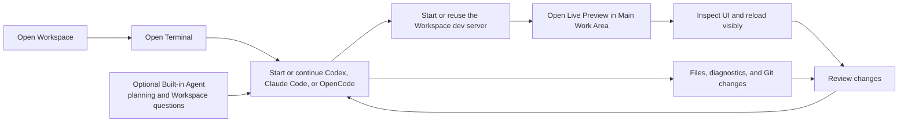

# Dez Live Preview and agent model

This document defines the first browser-preview vertical slice and the product
boundary between terminal-native agents and the optional Built-in Agent.
[Fork Notes](./fork-notes.md) remain the permanent source of truth. The
[v0.2 Workspace Polish](./v0.2-workspace-polish.md) contract is the active
source lane. Live Preview remains out of scope until the current Workspace and
terminal candidate passes its exact-package runtime gate and a later release
makes an explicit expansion decision.

## Product decision {#product-decision}

Dez is terminal-first and agent-capable, not chat-first.

- **Terminal is the default execution surface.** It runs Codex, Claude
  Code, OpenCode, and other terminal-native tools in a real PTY, with their
  normal subscriptions, authentication, TUI, commands, and plugins. The
  terminal remains the interactive source of truth and the packaged terminal
  host owns its durable local process.
- **Built-in Agent is the optional structured surface.** Use it for planning,
  questions grounded in the active Workspace, provider-backed edits, and
  structured tool calls when a usable provider and model are configured. It
  does not replace or wrap terminal agents.
- **Live Preview is a normal Main Work Area Surface.** It renders the
  application being developed beside files, a terminal, or a diff. It is not a
  permanent sidebar, floating overlay, dashboard card, or hidden panel mode.

All three paths use the same Workspace, files, Git state, diagnostics, and review
tools. Workspaces observes meaningful Agent Sessions and returns to their
existing Surface; it never copies a terminal transcript or browser session.

## Recommended everyday workflow {#recommended-workflow}



Use the Built-in Agent when its structured conversation is genuinely useful.
Use a Terminal for long-running autonomous work, CLI-specific
capabilities, subscription-backed tools, and any workflow whose terminal state
must survive the GUI. This keeps the default understandable while preserving
both models.

## Surface contract {#surface-contract}

Live Preview has one owner and one placement:

| Concern                                                      | Owner                    |
| ------------------------------------------------------------ | ------------------------ |
| Dev-server process, command, logs, and exit state            | Terminal or task Surface |
| Preview URL, history, reload state, viewport, and page title | Live Preview Surface     |
| Files, buffers, diagnostics, Git, and diffs                  | Active Workspace         |
| Agent lifecycle and attention projection                     | Workspaces               |
| Layout, tab history, split, zoom, and restoration            | Main Work Area           |

The minimum visible chrome is one compact native subtoolbar:

```text
┌ Back ─ Forward ─ Reload ─ localhost:3000 ─ Open Externally ─ Preview Options ┐
│                                                                              │
│                         rendered application                                 │
│                                                                              │
└ status: connected · Workspace dev server · agent control off ────────────────┘
```

The pane tab bar remains the only tab owner. Live Preview must not add a second
tab bar, duplicate Workspace title, mascot, toast lane, or panel-sized
background. Lumin Blur uses the same one-window material contract as every
other Surface; the rendered web page owns only its viewport.

At narrow widths, the URL yields first, controls move into Preview Options, and
Back, Reload, security state, and external open remain reachable. The preview
may stack below the focused editor or terminal, but it must never cover the
Main Work Area.

## Why this cannot be a layout-only patch {#native-view-boundary}

Current source has Markdown, SVG, and CSV preview items plus an action that
opens a URL in the system browser. It does not have an embedded browser
Workspace item. The inherited `BrowserDevelopment` recipe arranges panes only;
it creates no browser and is not a public Dez layout.

On macOS, GPUI currently owns one native `NSView` covering the complete
window. A `WKWebView` inserted above that view would sit above GPU-rendered
menus, prompts, notifications, split clipping, and focus surfaces. That would
recreate the overlay, interception, and sizing failures the Dez shell is
designed to remove.

A real implementation therefore begins with a pane-scoped native-surface host
contract:

- attach and detach a platform child surface through a stable item lifetime;
- update its bounds and scale after every layout pass;
- clip it to the pane and all ancestor scroll or split bounds;
- order it correctly below GPUI menus, prompts, tooltips, drag targets, and
  transient notifications;
- hand keyboard, pointer, accessibility, and focus ownership back and forth;
- hide or throttle it when occluded, inactive, zoomed away, or restored off
  screen;
- remove it synchronously when its item or window closes; and
- expose an opaque fallback on platforms without a supported embedded engine.

No public **Live Preview** command or layout may ship until that contract and a
real browser item exist. A blank split, system-browser launcher labeled as an
embedded preview, or always-on-top native child view is not an acceptable
substitute.

## Delivery slices {#delivery-slices}

### Slice 0: truthful source boundary

- Keep the existing system-browser URL action explicitly external.
- Keep Markdown, SVG, and CSV preview behavior unchanged.
- Reject hidden `BrowserDevelopment` and other non-public layout recipes in
  Dez so legacy commands cannot manufacture empty panes.
- Document that Live Preview is planned rather than present.

### Slice 1: platform surface host

- Add a platform-neutral GPUI child-surface contract.
- Implement pane-scoped macOS hosting first with lifecycle, clipping, z-order,
  focus, resize, and accessibility tests.
- Keep Linux and Windows behind explicit unavailable states until their native
  engine paths meet the same contract.
- Add a visual harness containing splits, menus, tooltips, notifications,
  zoom, drag targets, Lumin Blur, and opaque fallback.

### Slice 2: Live Preview Workspace item

- Implement URL validation, Back, Forward, Reload, Stop, address entry,
  security state, external open, and page title.
- Persist safe navigation metadata without cookies, credentials, form data, or
  page transcripts.
- Restore the item in place and show honest offline, server-ended, invalid URL,
  and engine-unavailable states.
- Add **Work Area + Live Preview** only after the item can populate the named
  surface. The public layout cycle must never create an empty preview pane.

### Slice 3: Workspace dev-server pairing

- Let a terminal or task explicitly publish a localhost URL as Workspace
  evidence.
- Offer **Open Live Preview** on that evidence without taking ownership of the
  server process.
- Prefer localhost and loopback targets; require deliberate confirmation for
  remote or public origins.
- Keep multiple server URLs named and scoped to their Workspace and Host.
- When the server ends, retain the preview with a reconnect/restart explanation
  rather than silently launching a replacement command.

### Slice 4: bounded agent tools

Expose only scoped, visible tools:

- list Workspace previews;
- open or navigate an approved preview;
- reload;
- capture the visible viewport;
- read bounded accessibility or DOM summaries;
- inspect bounded console and network errors; and
- highlight a target for user confirmation.

Agent activity must show the controlling Actor, target Workspace and origin,
current action, Stop control, and permission state. Navigation, page input,
downloads, clipboard access, credentials, camera, microphone, geolocation, and
cross-origin requests remain separately permissioned. Background control may
not steal focus.

## Acceptance gate {#acceptance-gate}

Live Preview is ready only when one exact candidate proves:

- a localhost app opens beside its owning terminal and editor;
- closing, moving, splitting, zooming, resizing, and restoring the item do not
  leave native views behind or cover GPUI chrome;
- Back, Forward, Reload, address entry, external open, keyboard traversal, and
  accessibility work;
- closing the preview does not stop the dev server, and losing the GUI does not
  stop a host-owned terminal;
- ending the server does not manufacture a replacement computation;
- Lumin Blur, Lumin Light, opaque fallback, reduced transparency, narrow,
  default, and wide layouts remain readable;
- menus, dialogs, tooltips, drag targets, notifications, and permission prompts
  always render above and receive input before the web content;
- restored metadata contains no cookies, tokens, form values, or page
  transcripts; and
- agent browser tools are visible, interruptible, origin-scoped, bounded, and
  audited.

Until this gate passes, the honest workflow is to run the dev server in an
Terminal and open its URL in the system browser.
